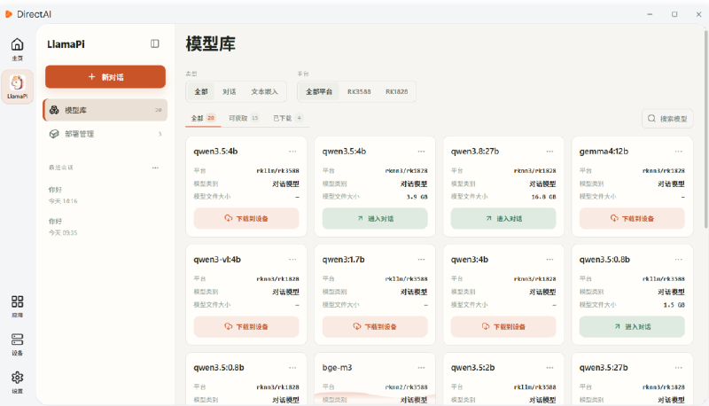
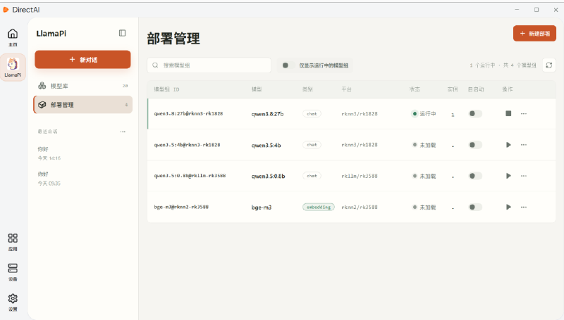

# LlamaPi

LlamaPi is a large-model deployment and management app: discover, download, and run local LLMs on the device, and serve them to third-party applications through an OpenAI-compatible API.

LlamaPi lowers the barrier to bringing on-device LLMs and local agents to production by packaging model download, format conversion, NPU inference, and service APIs. Whether you are prototyping or building an offline, private AI service, LlamaPi shortens the development cycle.

## Model Management

LlamaPi provides full model management — query, download, and clean up models without juggling scattered weight files. Browse the model library in the desktop client and handle downloads, local model review, and cleanup with a few clicks.

## Deployment Management

LlamaPi makes it easy to manage local model services. Load, unload, and set models to auto-start at boot directly from the desktop client, with the current running status always visible.

## Model Chat

Once a model is loaded, chat with it in the built-in interface to verify results, or serve it to your own application through the OpenAI-compatible API.

## Related Documents

- Full documentation: [LlamaPi Wiki](../../LlamaPi/llamapi/introduction.md)
- Install apps in DirectAI: [Install Apps](../getting-started/install-app.md)
