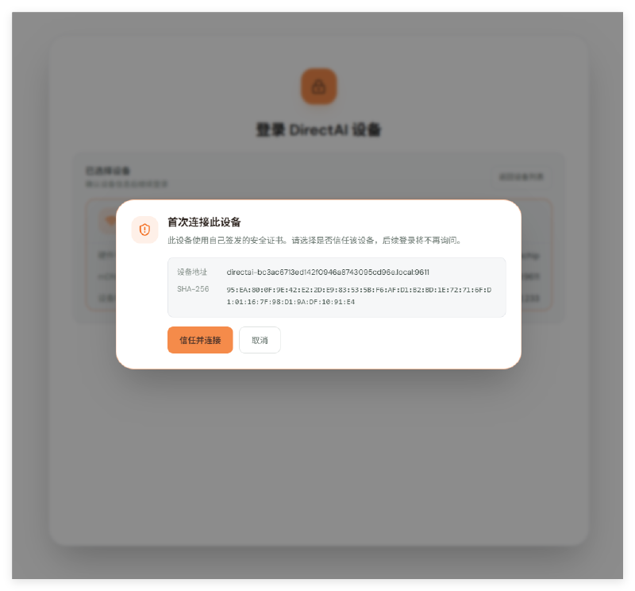

# Quick Start

This section walks you through installing the DirectAI client and connecting your first device.

## Install the DirectAI Client

Get the DirectAI client installer from the [Firefly Download Center](https://community.t-firefly.com/doc/download/429).

Run the installer and follow the wizard to complete the installation, then start DirectAI.

## Connect a Device

After starting the client, go to the sign-in page and discover devices through **Network discovery** or **USB discovery**:

- **Network discovery**: scans the LAN for devices, for devices already on the network.
- **USB discovery**: finds devices connected over a USB cable, for first-time setup or offline environments.

Select a target device from the scan results, confirm when prompted, and sign in with the device's Linux username and password.

## Install Your First App

After signing in, open the app store:

1. Pick an app from the list (for example LlamaPi).
2. Click install — the client deploys the app frontend locally and installs the device-side service automatically.
3. Once installed, the app appears in the sidebar and is ready to use.

You can also drag an existing app package into the app store window to import it.

## Next Steps

- Install, update, and uninstall apps: [Install Apps](./install-app.md)
- Device not connecting or sign-in failing: [FAQ and Troubleshooting](../directai/faq.md)
