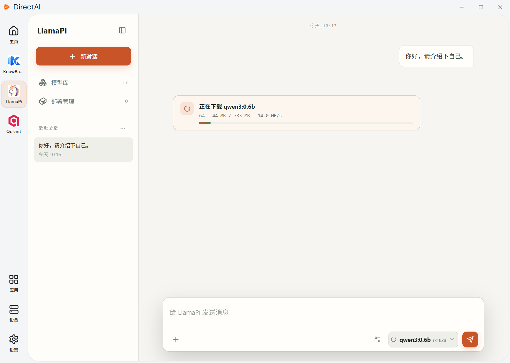
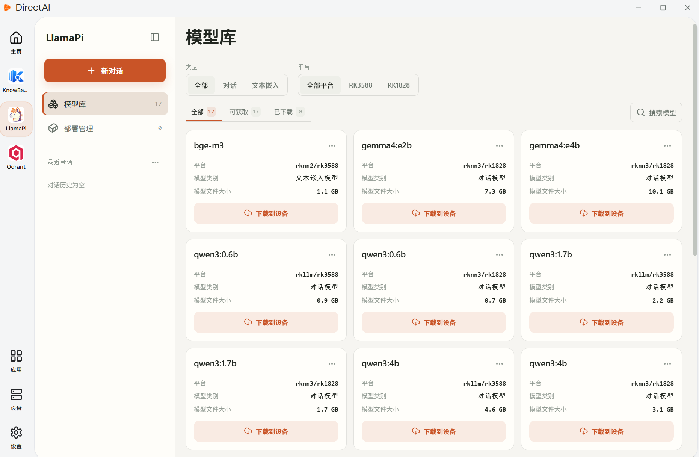
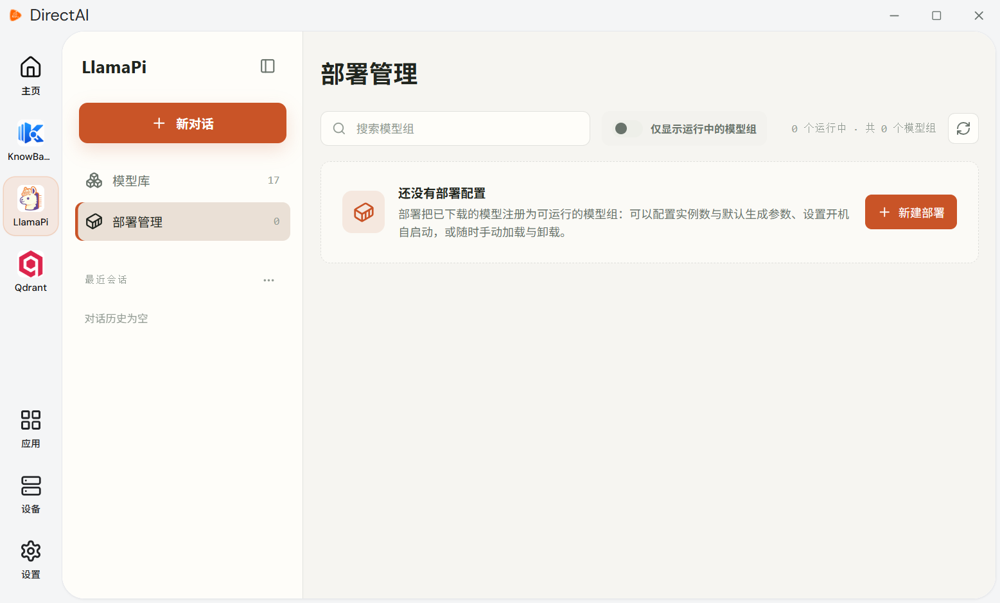
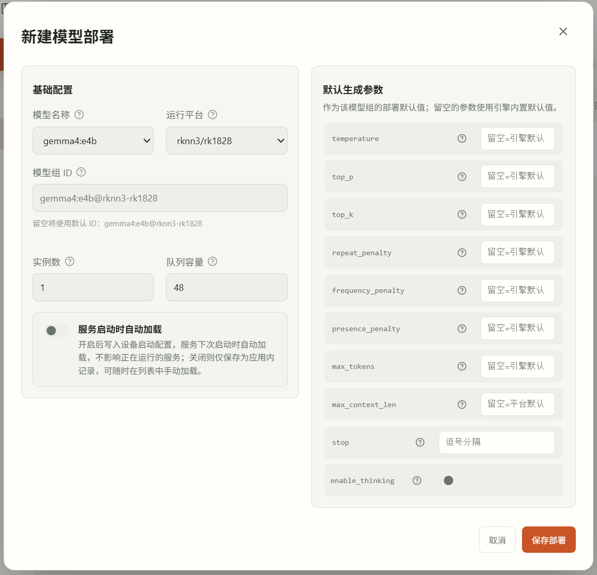
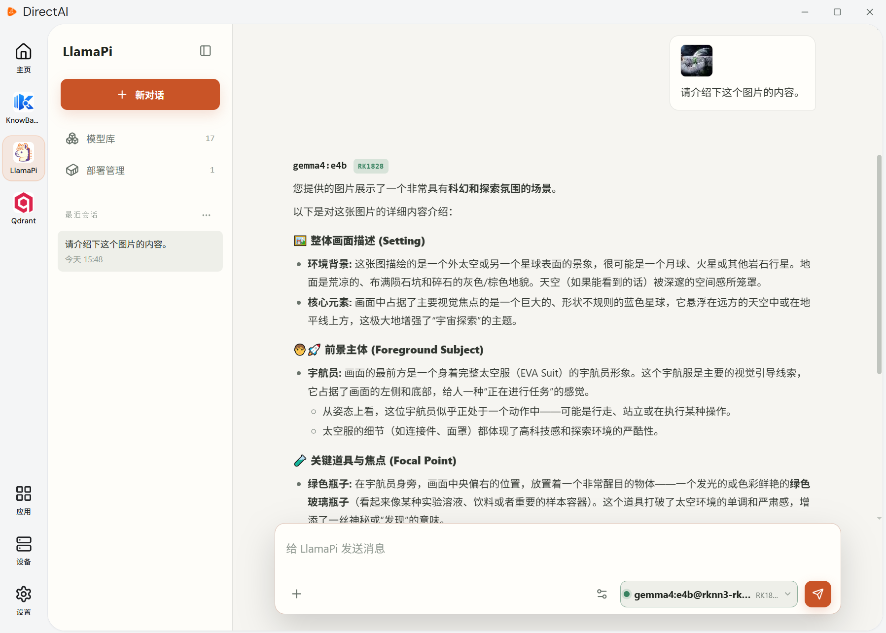

# Using the Client

Besides the command line, LlamaPi provides a Windows client. The client can perform all operations covered in this guide: downloading, loading, running, and deploying models, and chatting with them in the client.

## DirectAI Client

The LlamaPi client app runs on the DirectAI platform. Download the DirectAI installer from the [Firefly website](https://community.t-firefly.com/doc/download/429), install it by following the [DirectAI documentation](https://community.t-firefly.com/docs/ai/applications/DirectAI/directai/introduction), and then open the client. DirectAI automatically scans the LAN for devices. Click a device to connect:

## Chat with a Model

On the new-chat page, select a model to chat with. LlamaPi downloads and loads the model automatically:

Once the model is ready, inference runs and the result is returned:

During the conversation, you can customize the model's parameter settings:

## Manage Local Models

On the LlamaPi `Model Library` page, browse the models available on the current hardware, download the ones you need, and delete the ones you no longer need:

## Load and Deploy Models

After a model is downloaded, open the `Deployment Config` page and click `New Deployment` to create a deployment configuration from a downloaded model. You can customize the deployment ID and the number of model instances, and configure the model's generation parameters:

A saved deployment configuration can be loaded and unloaded on demand, or configured to load automatically when the device starts:

## Chat with a Model Deployment

On the LlamaPi `New Chat` page, select a loaded model group to chat with:

Send messages to the running model deployment:

