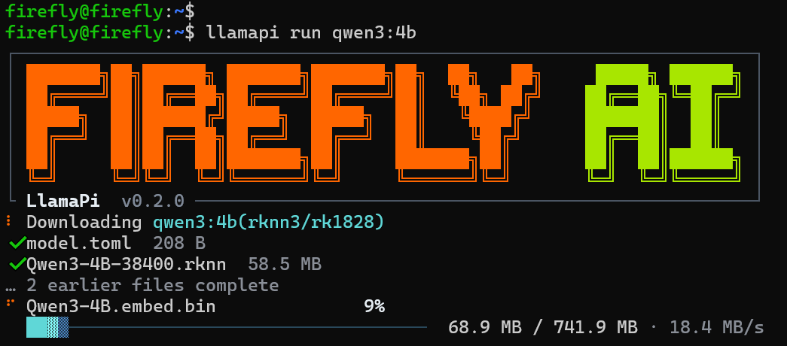

# Quick Start

This section explains how to install LlamaPi and run your first model.

## Install LlamaPi

If the Firefly APT repository is configured on the device, install LlamaPi directly:

```bash
sudo apt install llamapi
```

Alternatively, copy the deb packages to the device, open their directory, and install them locally:

```bash
sudo dpkg -i ./firefly-llamapi-*.deb
```

## Use LlamaPi to Run a Model

Use the `llamapi run` command to run the `qwen3:4b` model:

```bash
llamapi run qwen3:4b
```

The `llamapi run` command automatically selects and downloads a model available on the current hardware:



After the model is downloaded and loaded, the terminal enters an interactive chat:


Chat with the model at the prompt, then use `/exit` or `Ctrl+D` to leave.

## View Models Available on the Current Hardware

List models available on the current hardware:

```bash
llamapi list --online
```

The following example uses an RK3588 + RK1828 hardware platform:


## Next Steps

- Download and remove local models: [Download and Manage Models](./model-download-and-management.md)
- Run and deploy models: [Run and Deploy Models](./model-load-and-run.md)
- Configure automatic loading at service startup: [Persistent Deployment](./model-persistence.md)
- Connect a model to an existing application: [Connect Third-Party Applications](./third-party-integration.md)
