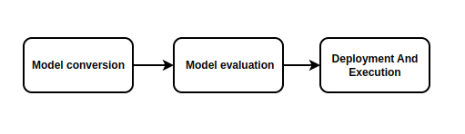

# RKNN2 Development Workflow

The RKNN SDK provides C/C++ and Python APIs for deploying common deep-learning models on Rockchip NPU platforms.

The RKNN2 development workflow consists of three stages:

1. **Model conversion**: use RKNN-Toolkit2 on an x86_64 PC to convert Caffe, TensorFlow, TensorFlow Lite, ONNX, Darknet, or PyTorch models into RKNN models.
2. **Model evaluation**: perform quantization, accuracy analysis, connected-device performance analysis, and memory usage analysis.
3. **On-device deployment**: load the RKNN model through the RKNPU2 C/C++ API or the RKNN-Toolkit Lite2 Python API, then perform preprocessing, inference, and postprocessing.



```text
Source model
   ↓
RKNN-Toolkit2 (PC)
   ├── Model conversion and quantization
   ├── Accuracy and performance evaluation
   └── Export an .rknn model
             ↓
RKNPU2 / RKNN-Toolkit Lite2 (AIBOX-PRO)
             ↓
          RK3588 NPU
```

RKNN-Toolkit2 runs on the PC and should not be installed on the AIBOX-PRO target device.
