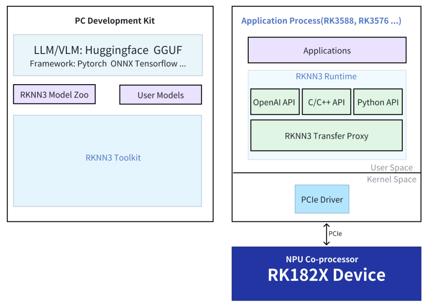

# RK1820/RK1828 Platform

The RKNN3 development chain in AIBOX-PRO consists of the RK3588 host, the RK1820/RK1828 coprocessor, and the PCIe communication link:

- **RK3588 host**: performs task scheduling, resource allocation, and overall system control.
- **RK1820/RK1828 coprocessor**: acts as the AI acceleration device and performs high-performance neural-network inference.
- **PCIe interface**: provides low-latency, high-bandwidth data exchange between the host and the coprocessor.

## rknn-smi

`rknn-smi` collects RK1820/RK1828 device information and provides configuration, status monitoring, and log management functions.

```bash
# Query software versions
sudo rknn-smi -v

# Query hardware information
sudo rknn-smi info -l

# Continuously monitor device status
sudo rknn-smi info -w

# Select performance mode
sudo rknn-smi set -t work_mode -s 2
```

AIBOX-PRO hardware does not support power queries through `rknn-smi info -t power`. For detailed usage, see `docs/Tools/Rockchip_User_Guide_RKNN-SMI_Tool_CN.pdf` in the RK182X SDK.

### Intermittent "Failed to initialize rknnsmi"

An appropriate startup delay can be added to `/lib/systemd/system/rknn3.service`:

```ini
[Unit]
Description=rknn3 runtime service
DefaultDependencies=no
After=local-fs.target

[Service]
Type=forking
ExecStartPre=/bin/sleep 3
ExecStart=/bin/rknn3_startup start
ExecStop=/bin/rknn3_startup stop

[Install]
WantedBy=sysinit.target
```

Before changing the system service, verify that the issue is caused by device initialization timing.

## RKNN3 SDK

The RKNN3 directory in the RK182X SDK has the following structure:

```text
rknn/
├── rknn3-model-zoo
├── rknn3-runtime
├── rknn3-toolkit
└── rknn-gstreamer-plugins
```



### RKNN3 Model Zoo

RKNN3 Model Zoo provides conversion and deployment examples for common models on RK1820/RK1828:

- [rknn3-model-zoo](https://github.com/airockchip/rknn3-model-zoo)

### RKNN3 Runtime

RKNN3 Runtime provides a C API. Developers can use C/C++ applications on the RK3588 host to run model inference on RK1820/RK1828.

### RKNN3 Toolkit

RKNN3 Toolkit runs on a PC and provides model conversion, inference testing, and performance evaluation.

RKNN3 Toolkit is **not compatible** with [RKNN-Toolkit](https://github.com/airockchip/rknn-toolkit) or [RKNN-Toolkit2](https://github.com/airockchip/rknn-toolkit2).

- [rknn3-toolkit](https://github.com/airockchip/rknn3-toolkit)
