---
---

# SpacemiT AI Lab

**SpacemiT AI Lab** is a web-based AI evaluation platform. A cloud K3 instance can be requested from a browser to evaluate model inference results and real performance data on a SpacemiT K3 AI CPU — **zero configuration, instant access**, and no hardware required.

K3 devices also include a built-in AI Lab desktop application for downloading models and running them locally.

## Key Capabilities

- **Cloud hardware access**: Request a cloud K3 instance and run inference directly on real hardware from a browser, with live results and performance metrics.
- **Vision models**: Object detection, image segmentation, pose estimation, and image classification.
- **Large language model chat**: Intelligent Q&A and text generation with streaming output.
- **VisionLanguage Model（VLM）**： Enables image understanding and visual question answering. Users can upload an image and query it in natural language, with analysis results returned via streaming.
- **Speech recognition (ASR)**: Audio-to-text transcription with real-time microphone input.
- **Speech synthesis (TTS)**: Text-to-speech playback.
- **Voice activity detection (VAD)**: Speech segment detection and boundary splitting.
- **Model performance dashboard**: View per-model performance metrics measured on real K3 hardware (FPS / RTF / token/s).

## Platform Support

| Platform & OS         | Supported |
| --------------------- | --------- |
| K1 Buildroot          | ❌ No        |
| K1 OpenHarmony        | ❌ No        |
| K1 Bianbu LXQT/GNOME  | ❌ No        |
| K3 Buildroot          | ❌ No        |
| K3 OpenHarmony        | ❌ No        |
| K3 Bianbu LXQT/GNOME  | ✅ Yes       |

## Architecture

### System Architecture Diagram

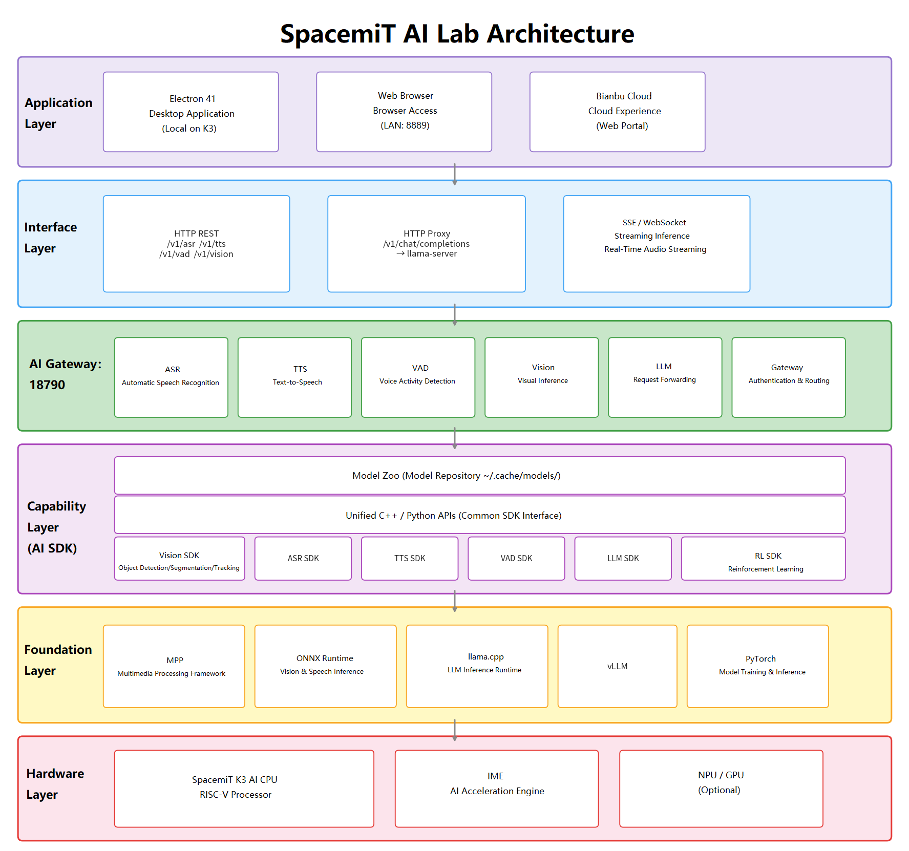

### Application Stack

- **Desktop framework**: Electron 41 (RISC-V optimized build, K3 local app)
- **Frontend**: Vanilla JavaScript + HTML5 + CSS3
- **Backend**: SpacemiT AI Gateway (port 18790)
- **Model inference**: ONNX Runtime (vision/speech models) + llama.cpp (LLM, VLM, SpacemiT-accelerated build)

### Dependent Services

- **AI Gateway**: Unified inference gateway that exposes ASR / TTS / VAD / Vision / LLM / VLM domain APIs over HTTP/WebSocket (`/v1/asr`, `/v1/tts`, `/v1/vad`, `/v1/vision`, `/v1/chat/completions`, `/v1/vlm/chat/completions`).
- **llama-server**: Standalone LLM / VLM  data-plane service; inference requests are proxied through AI Gateway.
- **Model data source**: Latest model metadata and performance data are fetched from the SpacemiT Model Zoo.

### Workflows

1. **Cloud experience**

   Bianbu Cloud → Official website entry → AI Lab home page → Run online inference → View live performance data

2. **Local experience**

   Launch the AI Lab desktop app → Local app page → Download model → Try Now → Run inference → View live performance data

3. **LAN sharing**

   Launch app → Copy share link → Open link in another device's browser

## Installation (K3 Local App)

### System Requirements

- **OS**: Bianbu 4.0 rc4 or later, LXQT or GNOME desktop
- **Hardware**: SpacemiT K3 RISC-V device
- **Memory**: 8 GB or more recommended
- **Storage**: At least 10 GB free space (for model downloads)

### Installation

```bash
sudo apt update
sudo apt install spacemit-ailab spacemit-ai-gateway
```

The installer automatically configures the required systemd services and creates a desktop shortcut.

### Verify the Installation

```bash
# Check AI Gateway service status
systemctl status spacemit-ai-gateway

# Check the service endpoint
curl -s localhost:18790/healthz
```

## Quick Start

### 1) Cloud Experience (Recommended)

No hardware required. Access the cloud platform directly:

1. Open [spacemit.com](https://www.spacemit.com/), click **Cloud**, select **AI Lab**, and navigate to the SpacemiT AI Lab cloud homepage.
   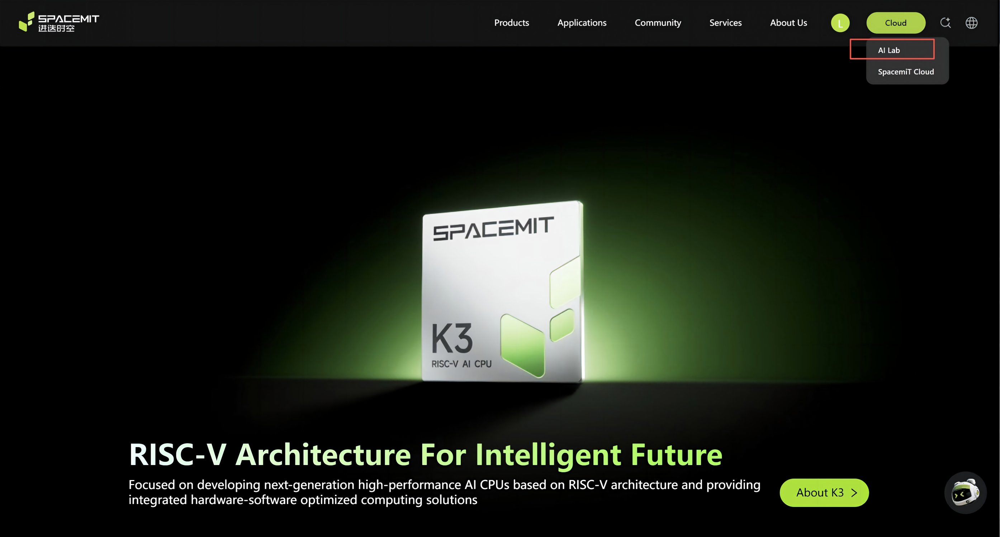

2. Click **Try Now** and wait for the system to allocate a cloud K3 instance (typically under 3 seconds).
3. Once the instance is ready, the browser is automatically redirected to the Model Center, where models can be run immediately.

> **Note**: Each session has a maximum duration of **2 hours**. The instance is automatically reclaimed when the session times out or the page is closed.

### 2) K3 Local App

Search for **AI Lab** in the system application menu, then launch it.

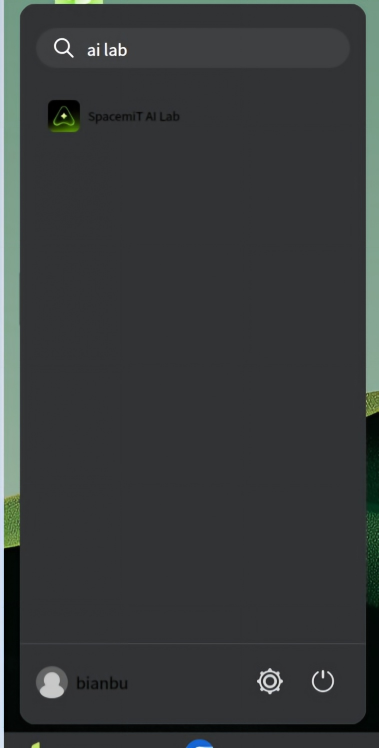


### 3) Interface Overview

After launch, the Model Center home page is displayed. It includes:

- **Top navigation bar**: LAN share link and copy button, auto-start on boot toggle, language switcher.
- **Instance status bar**: Displays remaining session time during cloud use.
- **Model category tabs**: Popular, LLM, Speech, Vision, VLM.
- **Model card grid**: Shows all available AI models with download and trial status.
- **Performance dashboard**: Per-model performance metrics on real K3 hardware.

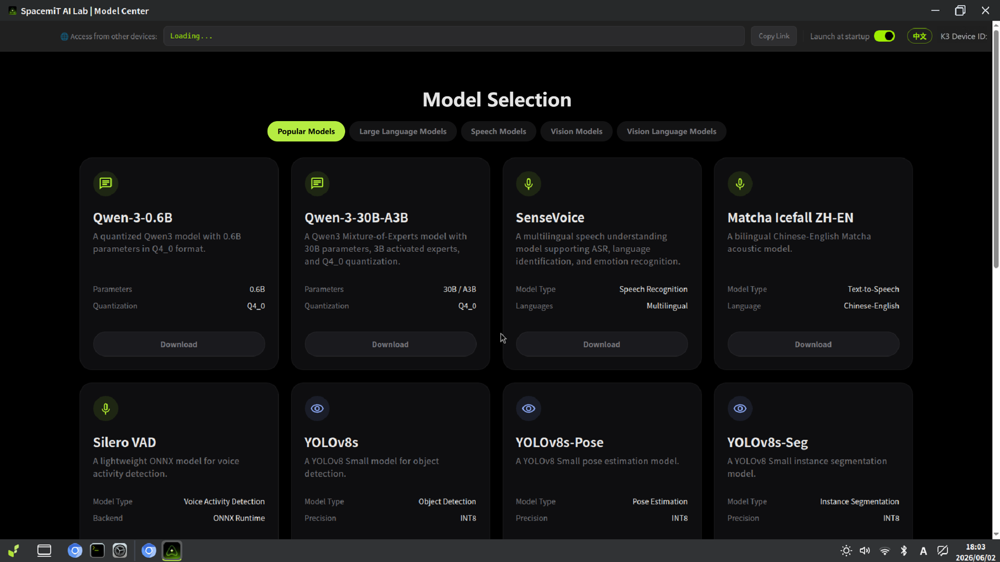

## Features

### Cloud Instance Management

#### 1) Requesting an Instance

On the cloud platform home page, check the number of available instances, then click **Try Now** to obtain a dedicated K3 instance.

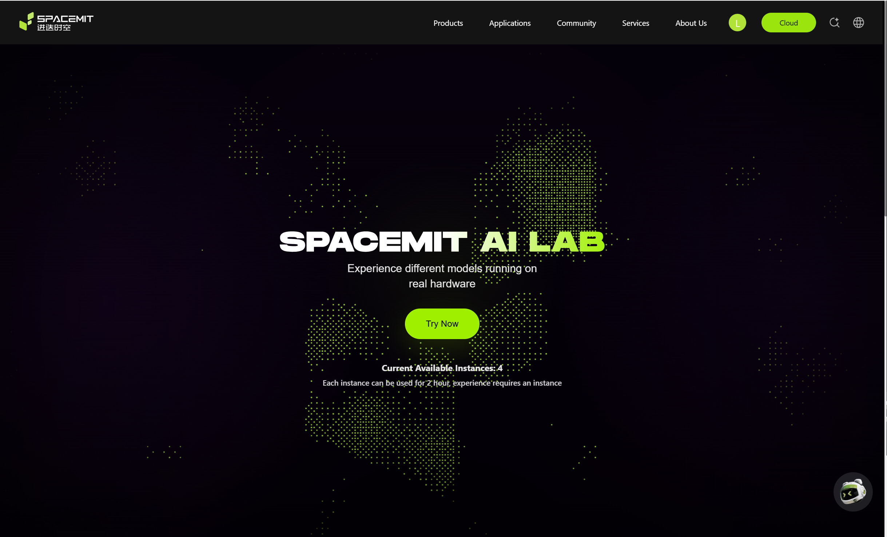

#### 2) Session Time

After entering the Model Center, the top status bar shows the remaining session time (up to 2 hours). A warning appears before the session expires.

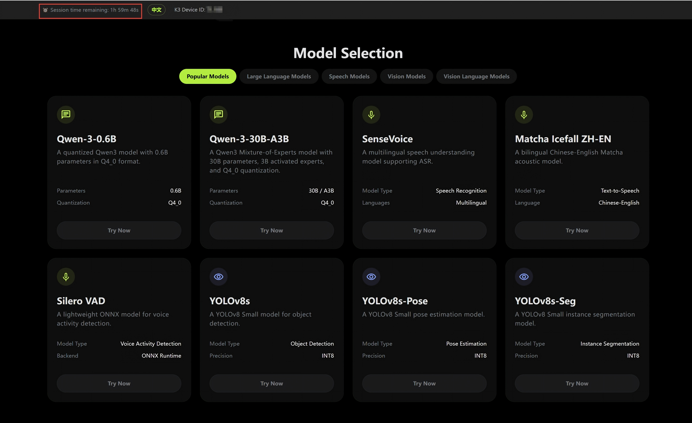

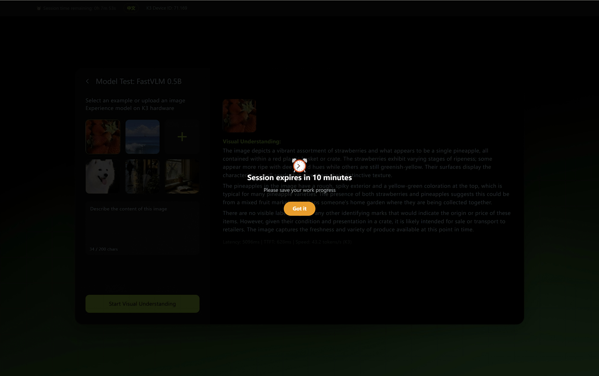

#### 3) Releasing an Instance

- **Automatic release**: The instance is reclaimed automatically after 2 hours or when the Model Center page is closed.

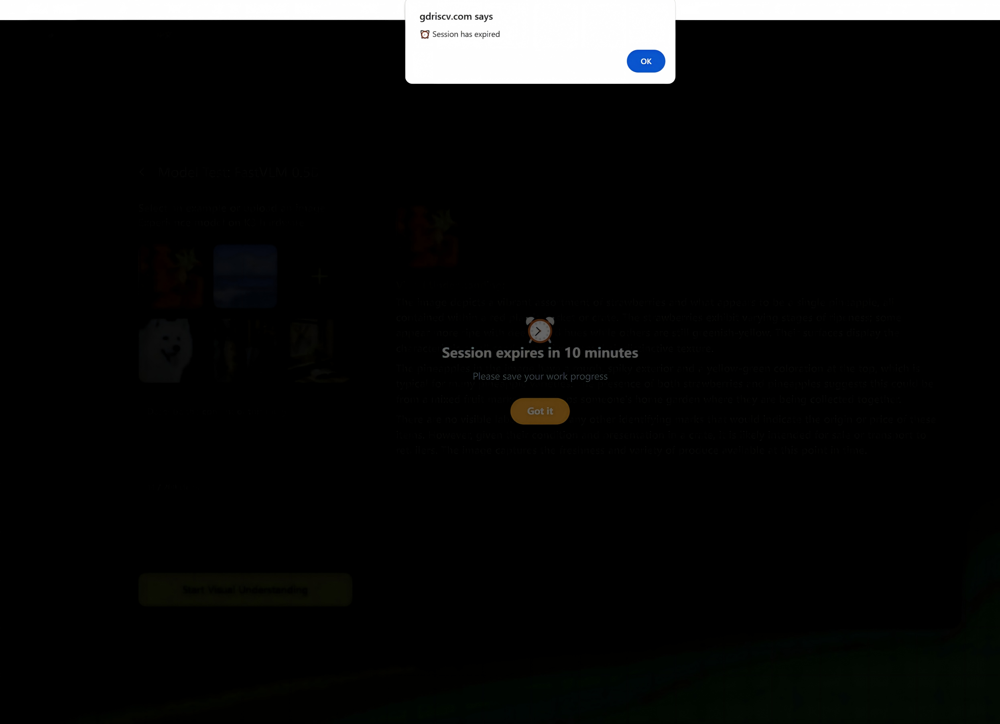

> **Privacy notice**: When an instance is released, the application automatically clears all user data generated during the session, including LLM conversation history, uploaded images, recordings, and audio temp files. All data is processed in memory only and is never persisted to disk.

### Model Center

#### 1) Browsing by Category

Click the category tabs at the top of the page to filter models:

- **Popular**: Most frequently used models.
- **Vision**: Object detection, image segmentation, pose estimation, image classification, and more.
- **LLM**: Conversational AI, text generation.
- **VLM**: Image understanding, visual question answering.
- **Speech**: ASR transcription, TTS synthesis, VAD detection.

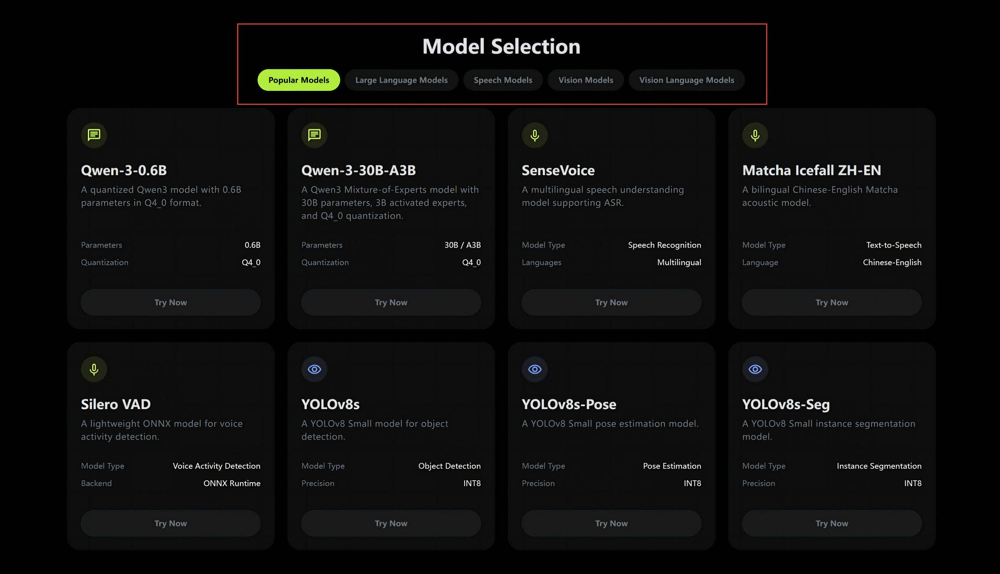

#### 2) Model Card Details

Each model card shows:

- Model name and task type
- Input specification (dimensions / format)
- Deployment precision (INT8, FP16, etc.)
- Download state: **Not downloaded** (shows the **Download Model** button) / **Downloading** (shows progress) / **Downloaded** (shows the **Try Now** button)

### Downloading Models

- Click **Download Model** on the model card to start the download.
- All models are stored under `~/.cache/models/`, organized by category.

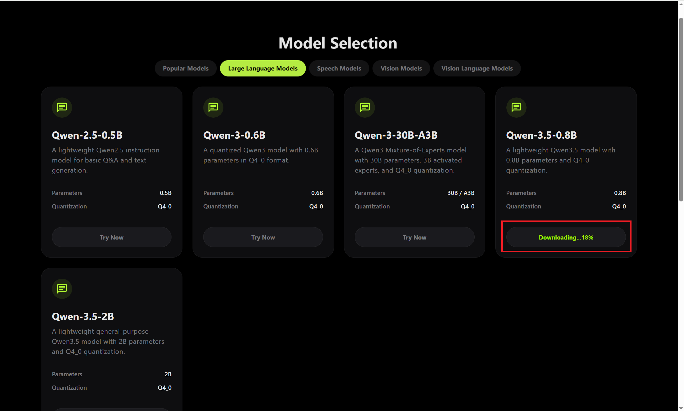

### Vision Models

1. Find a vision model in the list (e.g., YOLOv8n, YOLOv11s) and click **Try Now**.
2. Select a sample image from the left sidebar, or click **Upload Image** to use a local file.
3. For object detection models, adjust the **Confidence** (default 0.35) and **IoU threshold** (default 0.45) as needed.
4. After inference, view the annotated result (bounding boxes / keypoints / segmentation masks) and the performance metrics.

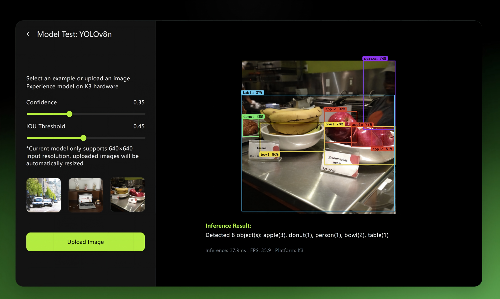

**Supported vision tasks:**

| Task                 | Representative models                                      |
| -------------------- | ---------------------------------------------------------- |
| Object detection     | YOLOv8n/s/m, YOLOv11n/s/m, YOLOv5-Gesture, YOLOv5n-Face  |
| Image segmentation   | YOLOv8n/s/m-seg series                                     |
| Pose estimation      | YOLOv8n/s/m-pose series                                    |
| Image classification | ResNet50                                                   |

### Large Language Model Chat

1. Find an LLM (e.g., Qwen-3-0.6B) and click **Try Now**.
2. Type a question in the input box at the bottom. Document links can also be attached. Press Enter or click the send icon.
3. The model streams its response back.
4. Click the copy button next to any message to copy the response.

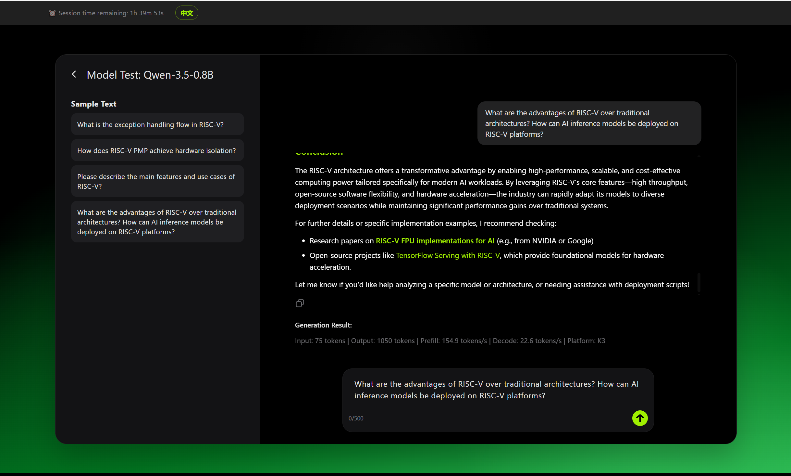

**Supported LLM models:** Qwen2.5, Qwen3, Qwen3.5 series, and more.


### Vision Language Model (VLM)

A Vision Language Model (VLM) can understand both images and natural language. After uploading an image, you can ask questions in natural language, then the model analyzes the image and generates a descriptive response.

1. Locate a VLM model in the model list (e.g., FastVLM-0.5B) and click **Try Now**.
2. Select an image source in the left sidebar:
  - **Sample Images**: Click one of the built-in sample images.
  - **Upload Image**: Click the upload button and select an image from your local device.( Up to three images can be previewed at a time. Click a thumbnail to switch the active image.)
3. Enter your question in the prompt box (up to 200 characters), for example: "Describe the content of this image."
4. Click **Start Visual Understanding** and wait for the model to process the image. An "Processing, please wait..." animation is displayed while inference is in progress.
5. When inference is complete, the right panel displays:
  - A thumbnail of the input image
  - A streamed response rendered in Markdown with a typewriter effect
  - Performance metrics, including **Latency, Time to First Token (TTFT), and Tokens/s**

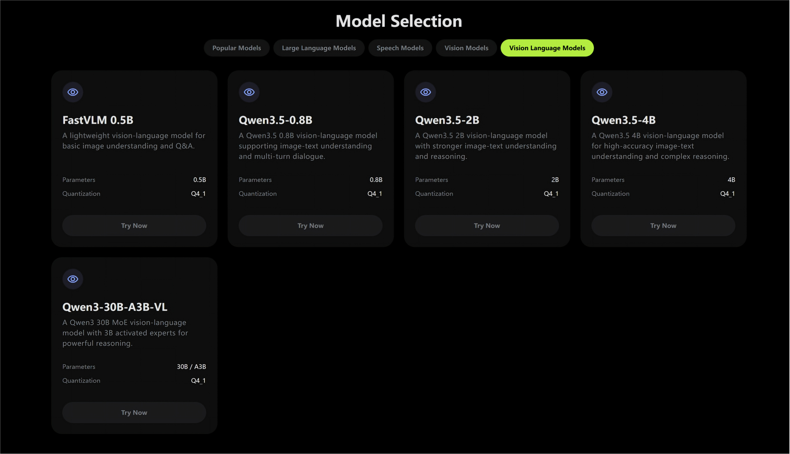

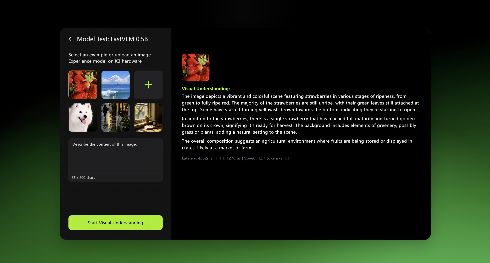

**Supported VLM Models**:
|Model|Parameters|Size|Description|
|--|--|--|--|
|FastVLM-MM-0.5B (Q4_1) | 0.5B      | ~766 MB  |Smallest model with the fastest response time, ideal for quick validation|
| Qwen3.5-VL-0.8B         | 0.8B      | ~932 MB  | Well-balanced performance|
| Qwen3.5-VL-2B           | 2B        | ~2.6 GB  | Strong visual understanding capabilities|
| Qwen3.5-VL-4B           | 4B        | ~3.9 GB  | High-accuracy image understanding|
| Qwen3-VL-30B-A3B (Q4_1) | 30B (MoE) | ~17.6 GB | Flagship model with the strongest visual understanding capabilities|

> **Notes**
> - Only a single image is supported per inference request.
> - Each prompt is limited to 200 characters.
> - The model is automatically unloaded when you leave the page to free GPU memory.


### Speech Recognition (ASR)

1. Find an ASR model (e.g., SenseVoice) and click **Try Now**.
2. Choose an input method:
   - **Sample audio**: Click a sample in the left panel to transcribe it immediately.
   - **Upload audio**: WAV format supported.
   - **Live recording**: Click **Start Recording**, speak, then click **Stop Recording**. Transcription runs automatically.
3. The result panel displays the transcribed text and processing time.

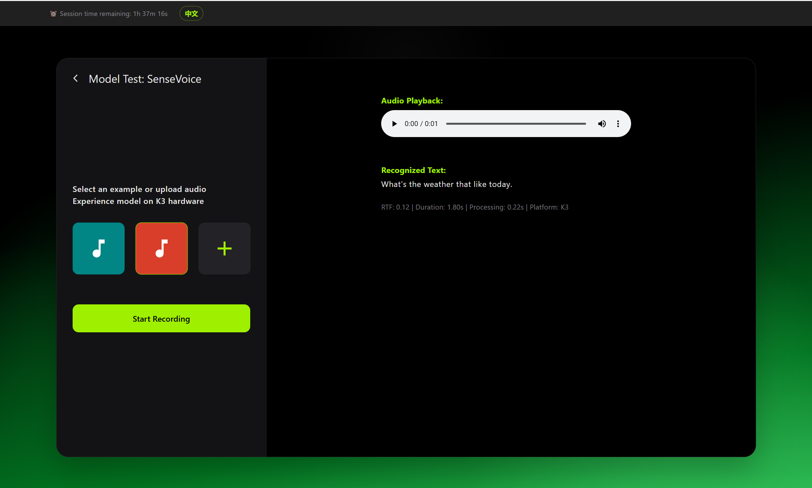

### Speech Synthesis (TTS)

1. Find a TTS model (e.g., Matcha Icefall EN-US, Matcha Icefall ZH-Baker, Matcha Icefall ZH-EN) and click **Try Now**.
2. Enter text in the input box (up to 500 characters).
3. Select Chinese or English input based on the model.
4. Click **Generate Audio**. Playback starts automatically after synthesis completes.

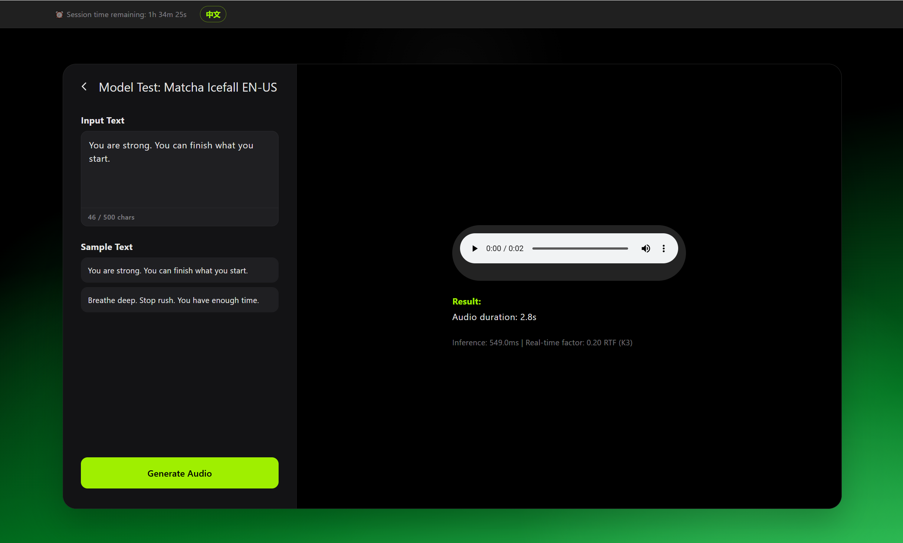

### Voice Activity Detection (VAD)

1. Find the VAD model (Silero VAD) and click **Try Now**.
2. Record audio or upload an audio file.
3. Detection results are displayed visually with speech activity segments and time boundaries.


### Model Performance Dashboard

View per-model performance metrics for K3 hardware at the bottom of the home page:

- Use the category tabs to filter LLM / Speech / Vision / VLM models.
- Metric definitions:

| Metric          | Full name         | Description                                                                                                            |
| --------------- | ----------------- | ---------------------------------------------------------------------------------------------------------------------- |
| PP128 (token/s) | Prompt Processing | Speed at which the model processes input prompts, measured over the first 128 tokens. Higher is better.                |
| TG128 (token/s) | Token Generation  | Speed at which the model generates output tokens, measured over subsequent 128 tokens. Higher is better.               |
| RTF             | Real-Time Factor  | Ratio of processing time to audio duration. RTF < 1 means real-time capable. Lower is better.                         |
| FPS             | Frames Per Second | Number of image frames processed per second by vision models. Higher is better.                                       |
| Quantization    | Quantization type | Model compression precision (e.g., Q4_0, Q8_0, INT8, FP16). Lower precision means smaller size and faster speed.      |

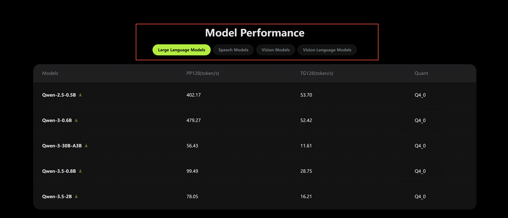

Models can also be downloaded from this view:

- Click the **Download** icon in the model row to start downloading.
- Files are saved to the browser's default download directory.

## Advanced Features

### Auto-Start on Boot

Toggle the **Auto-Start on Boot** switch in the top bar so AI Lab starts automatically with the system, making it always accessible to other devices on the local network.

### Language Switch

Click the language button (EN / Chinese) in the top-right corner to switch the interface language.

### LAN Sharing

LAN sharing is enabled automatically when the app starts.

1. Note the access URL shown at the top of the interface.
2. Other devices on the same local network can open that URL in any browser — no installation required.

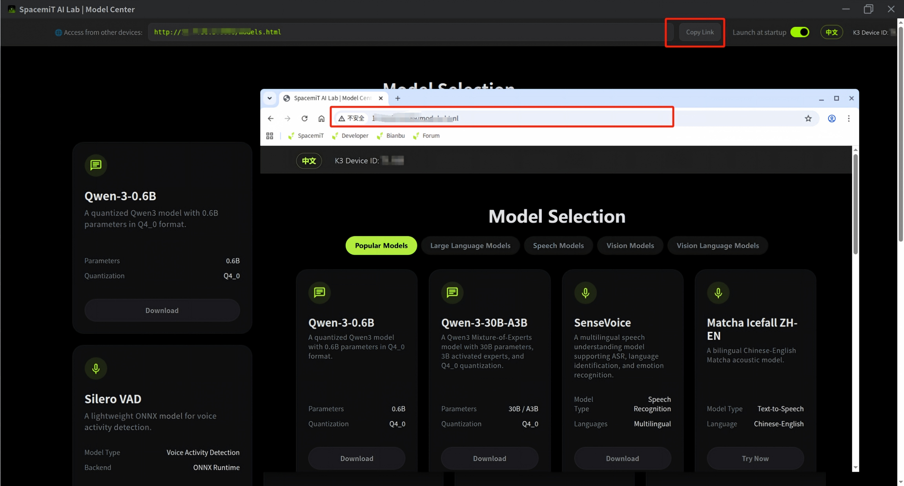

## FAQ

### App fails to start

```bash
# Check AI Gateway service status
systemctl status spacemit-ai-gateway

# Restart the service
sudo systemctl restart spacemit-ai-gateway

# Check for port conflicts
netstat -tulpn | grep 18790
```

### Model download fails

- Verify the network connection is working.
- Check available disk space: `df -h`
- Remove unused model files and retry.

### Inference is slow

- Use a smaller model variant (e.g., YOLOv8n instead of YOLOv8m, FastVLM-0.5B instead of Qwen3.5-VL-4B).
- Close other resource-intensive applications.
- Run only one inference task at a time.

### VLM Results Are Inaccurate?

- Try using a larger VLM model (for example, switch from FastVLM-0.5B to Qwen3.5-VL-2B).
- Refine your prompt by asking more specific questions.
- Ensure the uploaded image is clear and has sufficient resolution.


### LAN sharing is not accessible from other devices

- Confirm both devices are on the same local network.
- Check that port 8889 is allowed through the firewall.

### How do I view logs?

```bash
# Stream AI Gateway logs
journalctl -u spacemit-ai-gateway -f
```

### How do I uninstall the app?

```bash
sudo apt remove spacemit-ailab spacemit-ai-gateway
# Optionally remove downloaded models
rm -rf ~/.cache/models/
```

## Supported Models

| Type   | Representative models              | Format |
| ------ | ---------------------------------- | ------ |
| LLM    | Qwen2.5 / Qwen3 / Qwen3.5 series  | GGUF   |
| Vision | YOLOv5/v8/v11 series, ResNet50     | ONNX   |
|  VLM  | FastVLM-0.5B, Qwen3.5series, Qwen3-30B-A3B-VL|GGUF（tar.gz package）|
| ASR    | SenseVoice, Qwen3-ASR              | tar.gz |
| TTS    | Matcha-TTS (Chinese / English)     | tar.gz |
| VAD    | Silero VAD                         | tar.gz |

## Support

- **Official documentation**: [SpacemiT documentation](https://www.spacemit.com/community/document)
- **Developer community**: [SpacemiT community](https://www.spacemit.com/community)
- **Issue reporting**: Submit via the community forum or GitLab Issues
