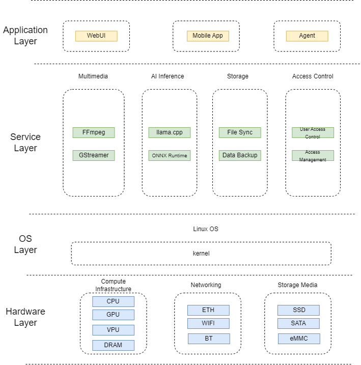
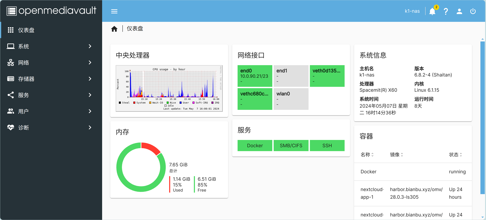
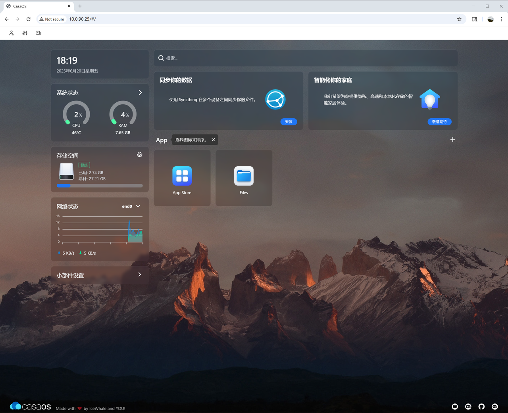

# AI NAS

**NAS** (Network Attached Storage) is a dedicated storage device that provides file, object, backup, media, and application services over network protocols. **AI NAS** (AI Network Attached Storage) extends traditional NAS storage capabilities with local AI inference. Unlike traditional NAS devices that only provide file storage and sharing, AI NAS can perform image recognition, video analysis, intelligent search, multimodal Q&A, and other AI tasks locally, keeping data off the cloud while improving privacy and latency.

## Core Capabilities

- **Image intelligence**: automatic image classification and tagging, face recognition and album clustering, image-based search, and EXIF metadata extraction.
- **Video intelligence**: video content analysis and scene splitting, intelligent editing and summarization, real-time video object detection and alerts.
- **Document intelligence**: OCR, PDF/Office document parsing, semantic vectorization, and full-text search.
- **Local Q&A**: large language model deployment (RAG), knowledge base management, multi-turn dialogue, and context memory.
- **Model management**: local model download, version switching, quantized format support, and CPU inference backend configuration.

## Platform Support

| Platform & OS | Support |
|---|---|
| K1 Buildroot | ✅ Yes |
| K1 OpenHarmony | ❌ No |
| K1 Bianbu LXQt/GNOME | ✅ Yes |
| K3 Buildroot | ✅ Yes |
| K3 OpenHarmony | ❌ No |
| K3 Bianbu LXQt/GNOME | ✅ Yes |

## Technical Architecture

### System Architecture Diagram



## Development Environment

| Development environment | Use case | Key advantages |
|---|---|---|
| Buildroot | Embedded firmware, minimized system images, lightweight products | Small image size, fast boot, high controllability |
| Debian | Feature validation, application ecosystem, higher-end products | Complete APT/OMV/Docker ecosystem and convenient development |

### Buildroot Development Environment

The Linux SDK built with Buildroot supports SpacemiT K-series chips. It includes the supervisor interface (OpenSBI), bootloader (U-Boot/UEFI), Linux kernel, root filesystem (including middleware and libraries), and examples. Its goal is to provide Linux support for the processor and enable driver or application development.

#### K1 Buildroot

[K1 Buildroot development documentation](https://www.spacemit.com/community/document/info?lang=en&nodepath=software/SDK/buildroot/k1_buildroot)

[K1 Buildroot source download](https://www.spacemit.com/community/resources-download/SDK/K1/Buildroot)

#### K3 Buildroot

[K3 Buildroot development documentation](https://www.spacemit.com/community/document/info?lang=en&nodepath=software/SDK/buildroot/k3_buildroot)

[K3 Buildroot source download](https://www.spacemit.com/community/resources-download/SDK/K3/Buildroot)

### Debian Development Environment

The Debian development environment is based on Bianbu OS, SpacemiT's official Debian-derived distribution. Bianbu is an operating system deeply optimized for RISC-V processors. It is built from Ubuntu community source code and provides the system foundation for SpacemiT AI CPUs. Bianbu provides the following images for developers and users:

- **GNOME desktop edition**: a native desktop edition preinstalled with GNOME Shell, Chromium, LibreOffice, MPV, and other applications.
- **LXQt desktop edition**: a lightweight desktop redesigned and developed based on LXQt for scenarios with strict resource and performance requirements.
- **Minimal edition**: a minimal system image that provides a command-line interface.

The Debian NAS solution is developed based on the Bianbu Minimal edition. K1 Bianbu 2.0 is built from Ubuntu 24.04 community sources, and K3 Bianbu 4.0 is built from Ubuntu 26.04 community sources.

The Bianbu development environment and the Buildroot development environment share the same BSP source code.

#### K1 Bianbu Image

[K1 Bianbu Minimal image](https://spacemit.com/community/resources-download/Images%20Collects/K1/Bianbu)

#### K3 Bianbu Image

[K3 Bianbu Minimal image](https://spacemit.com/community/resources-download/Images%20Collects/K3/Bianbu)

#### Custom Rootfs Image

[Bianbu rootfs creation](https://spacemit.com/community/document/info?lang=zh&nodepath=software/SDK/bianbu/system_integration)

## Multimedia Feature Development

The VPU on the SpacemiT platform is implemented based on the V4L2 framework and provides hardware video encoding and decoding.

- **Decode formats**: H.264 / HEVC / VP8 / VP9 / MJPEG / MPEG-4
- **Encode formats**: H.264 / HEVC / VP8 / VP9 / MJPEG

### FFmpeg User Guide

[FFmpeg user guide](https://www.spacemit.com/community/document/info?lang=en&nodepath=software/SDK/buildroot/k3_buildroot/media/ffmpeg_user_guide.md)

### GStreamer User Guide

[GStreamer user guide](https://www.spacemit.com/community/document/info?lang=en&nodepath=software/SDK/buildroot/k3_buildroot/media/gstreamer_user_guide.md)

## AI Feature Development

### AI Development Environment

#### Buildroot AI Development Environment

The Buildroot release has integrated `llama.cpp` and `spacemit-onnxruntime`.

#### Bianbu AI Development Environment

Install `llama.cpp`:

```bash
sudo apt update
sudo apt install llama.cpp-tools-spacemit
```

Install `spacemit-onnxruntime`:

```bash
sudo apt-get update
sudo apt-get install -y spacemit-onnxruntime libopencv-dev python3-spacemit-ort python3-pillow python3-matplotlib python3-opencv
```

### AI Features

AI NAS can use SpacemiT's intelligent computing platform [AI SDK](https://www.spacemit.com/community/document/info?lang=en&nodepath=ai/application_tools/ai-sdk.md) to implement the following AI features.

#### Intelligent Media Library

- **Image recognition**: classification, object detection, face detection, face features, emotion recognition, and pose recognition.
- **Video analysis**: frame extraction, object detection, multi-object tracking, and key-frame summarization.
- **Album features**: person clustering, scene tags, duplicate image detection, and natural language search.
- **Media Q&A**: VLM generates image descriptions and supports queries such as "What is in this image?" and "Find photos with cats."

#### Private Knowledge Base and RAG

- **Document ingestion**: PDF, TXT, Markdown, Office documents, and OCR text extracted from images.
- **Vectorization**: generate knowledge bases by shared directory, user, project, or tag.
- **Retrieval-augmented Q&A**: the LLM SDK `/api/chat` API supports `kb_ids` for RAG Q&A against specified knowledge bases.
- **Knowledge base management**: the LLM SDK provides APIs for knowledge base creation, file upload, vectorization, progress queries, chunk debugging, and deletion.
- **Asset service**: the LLM SDK Assets API can proxy MinIO static files and supports Range requests, making it suitable for document, audio, and image previews.

#### Voice and Meeting Center

- **ASR**: transcribe audio files for meeting recordings, personal voice notes, and video subtitle generation.
- **TTS**: convert text to speech for voice announcements and headless device interaction.
- **VAD**: voice activity detection to reduce silent segment processing.
- **Voiceprint / speaker diarization**: identify speakers in multi-speaker meeting records and family member scenarios.

#### Local AI Assistant

- **Local chat**: the LLM SDK, llama-server, or Ollama provides OpenAI-compatible or REST APIs.
- **Model management**: download, cancel download, start, stop, switch the current model, and query service status.
- **Session management**: create sessions, manage message history, rename sessions, and delete sessions.
- **Multimodal Q&A**: VLM supports image description, visual question answering, and multi-turn image-text conversations.
- **Agent extension**: expose NAS file search, album search, backup tasks, download tasks, and system diagnostics as tools.

## Storage Solution Design

### Disk Identification and Device Model

It is not recommended to persistently bind storage to `/dev/sda` or `/dev/nvme0n1` during development:

- Disk unique ID: prefer WWN/serial; account for USB bridge chips that do not expose a serial number.
- Partition ID: use PARTUUID.
- Filesystem ID: use UUID/LABEL.
- Web UI display: model, serial number, capacity, interface, temperature, SMART status, and RAID array membership.

### RAID Selection

| Mode | Minimum disks | Capacity | Redundancy | Use case |
|---|---:|---|---|---|
| Single | 1 | 1 disk | None | Entry-level, external disks |
| JBOD/Linear | 2 | Sum | None | Capacity-first; not recommended for important data |
| RAID0 | 2 | Sum | None | Temporary high-speed cache |
| RAID1 | 2 | 1 disk | 1 disk | Preferred for two-bay home NAS |
| RAID5 | 3 | N-1 | 1 disk | Balance between capacity and redundancy for multi-bay devices |
| RAID6 | 4 | N-2 | 2 disks | Large-capacity disks and long rebuild scenarios |
| RAID10 | 4 | N/2 | 1 disk per mirror group | Performance and fast recovery first |

Recommendations:

- Create MD RAID using whole raw disks or standard GPT partitions; keep all member disks at the same capacity.
- Use RAID metadata version 1.2. Evaluate version 1.0 only for special boot partition scenarios.
- During RAID5/6 rebuilds, throttle background tasks and notify users of degraded performance.
- USB-connected data disks are not recommended for production RAID arrays.

### Filesystem Selection

| Filesystem | Advantages | Risks / limitations | Recommended use |
|---|---|---|---|
| ext4 | Stable, mature recovery tools, low resource usage | Weak snapshot capability | Default general-purpose data disk |
| xfs | Good large-file and concurrency performance | Difficult to shrink | Video, backup, and large files |
| btrfs | COW, snapshots, checksums, compression | Higher operational complexity; use RAID5/6 carefully | Snapshots and lightweight data protection |
| zfs | Strong data integrity and snapshots | Kernel module and memory requirements | High-end Debian/plugin route |

### Shared Directories and Permissions

Permission policy:

- Use Linux users/groups and POSIX ACLs at the Linux layer.
- Enable `vfs objects = acl_xattr recycle streams_xattr` at the SMB layer.
- NFS depends on UID/GID mapping and should not be exposed to the internet.
- Enable home directory shares separately and avoid mixing them with public shares.

### SMART and Health Monitoring

Monitoring items:

- SMART overall-health.
- Temperature, power-on hours, reallocated sectors, pending sectors, and uncorrectable errors.
- NVMe media errors, percentage used, and critical warning.
- RAID status: clean, degraded, recovering, resync.
- Filesystem read-only state, mount failures, and I/O errors.

Alert levels:

- P0: array degraded, dual-disk errors, filesystem read-only.
- P1: SMART failed, bad sector growth, over-temperature.
- P2: capacity above 85%, individual service failure, backup failure.

## Network Solution Design

### Basic Networking

- Use DHCP by default. The Web UI supports static IP configuration.
- Support IPv4/IPv6 dual stack. IPv6 does not expose the management interface to the public internet by default.
- mDNS hostname: `nas-dev.local`.
- Windows discovery: use wsdd2 to reduce dependency on SMB1/NetBIOS.
- MTU defaults to 1500. Jumbo Frames can be enabled for 2.5G/10G intranets, but the entire path must use a consistent MTU.

### Advanced Networking

- Bonding: use active-backup mode for reliability. 802.3ad requires switch-side LACP.
- VLAN: isolate enterprise or lab network segments.
- Firewall: open only Web, SSH, SMB, NFS, rsync, and Docker mapped ports by default.
- Service binding: restrict management services to LAN interfaces and do not listen on WAN/hotspot interfaces.

### Performance Tuning

Check items:

```bash
ethtool eth0
ethtool -k eth0
ip -s link show eth0
ss -tulpn
```

Items to evaluate:

- TCP congestion control: `bbr` or `cubic`.
- NIC offload: GRO/GSO/TSO/RSS.
- Samba parameters: use `server multi channel support`, `aio read/write size`, and `socket options` with caution.
- IRQ CPU binding and RPS/XPS: evaluate on high-throughput platforms.

## Performance Testing

### AI Performance

- Vision: single-frame inference latency, FPS, CPU/TCM usage, and model loading time.
- ASR: RTF, transcription accuracy sampling, and long-audio stability.
- TTS: first-packet latency, synthesis speed, and audio quality sampling.
- LLM: prefill tokens/s, decode tokens/s, first-token latency, context length, and concurrency.
- RAG: document parsing speed, vectorization speed, recall accuracy, and Q&A latency.
- System impact: SMB/NFS throughput degradation ratio, disk queue depth, temperature, and peak memory usage.

### Storage Basic Tests

| ID | Test case | Steps | Expected result |
|---|---|---|---|
| ST-001 | Disk identification | Insert SATA/NVMe/USB disks and run `lsblk -J`, `blkid` | Model, capacity, serial number, and interface are correct |
| ST-002 | Partitioning and formatting | Create a GPT partition and format it as ext4/xfs/btrfs | Mounted successfully to `/srv/poolX` |
| ST-003 | UUID mount | Reboot 3 times and swap disk order | Mount path remains stable |
| ST-004 | Hotplug | Plug and unplug a USB disk 20 times | No kernel panic; UI state refreshes correctly |
| ST-005 | Filesystem full | Write data until 95%/100% full | Alert is triggered and services do not crash |
| ST-006 | Power-loss recovery | Cut power during writes, then reboot and run fsck/mount | Data disk can recover or clearly enters maintenance mode |

### RAID Tests

| ID | Test case | Steps | Expected result |
|---|---|---|---|
| RD-001 | RAID1 creation | Create RAID1 with two disks, format and mount | `/proc/mdstat` is clean |
| RD-002 | RAID5 creation | Create RAID5 with three disks | Status is clean after synchronization completes |
| RD-003 | Degraded read/write | Remove one disk from RAID1/5 and continue SMB writes | Service remains available and a P0 alert is raised |
| RD-004 | Replacement and rebuild | Insert a new disk and run recover | Rebuild completes and data verification passes |
| RD-005 | Assemble after reboot | Reboot after RAID creation | mdadm automatically assembles the array |
| RD-006 | Foreign array import | Import an array created on another Linux system | The array can be identified and mounted; UI prompts for import |

Common commands:

```bash
cat /proc/mdstat
mdadm --detail /dev/md0
mdadm --examine /dev/sdX
```

### SMART Tests

| ID | Test case | Steps | Expected result |
|---|---|---|---|
| SM-001 | SMART read | `smartctl -a /dev/sdX` | Health status and temperature can be parsed |
| SM-002 | Short test | `smartctl -t short /dev/sdX` | Task can start and results can be queried |
| SM-003 | NVMe health | `smartctl -a /dev/nvme0` | Fields such as critical warning are correct |
| SM-004 | Alert simulation | Use a test disk or mock output with bad sectors | UI/email/log alert is generated |

### Local I/O Performance Tests

NAS storage performance tests should be split into three layers: block device, filesystem, and protocol sharing. Block device tests determine the upper bound of disks and controllers; filesystem tests verify ext4/xfs/btrfs, RAID, cache, and mount parameters; SMB/NFS tests verify the final user experience.

Preparation:

```bash
# Check devices, mount points, filesystems, and scheduler
lsblk -o NAME,TYPE,SIZE,MODEL,TRAN,MOUNTPOINT,FSTYPE
df -hT
cat /sys/block/<dev>/queue/scheduler

# Ensure the test directory has enough space. The test file size should be larger than 2x memory capacity.
mkdir -p /srv/pool1/test
```

Items to record:

- Device information: disk model, interface, filesystem, RAID level, and mount parameters.
- System status: CPU, memory, temperature, I/O wait, and RAID rebuild status.
- Performance metrics: throughput, IOPS, average latency, P95/P99/P99.9 latency.
- Test parameters: block size, queue depth, concurrency, file size, direct I/O, and runtime.

#### `dd` Basic Sequential Read/Write

`dd` is suitable for quick smoke tests. It is available by default on most systems, but provides limited metrics and cannot replace fio/iozone/vdbench.

Filesystem sequential write:

```bash
dd if=/dev/zero of=/srv/pool1/test/dd_write.bin bs=1M count=8192 \
  conv=fdatasync status=progress
```

Filesystem sequential read:

```bash
sync
echo 3 > /proc/sys/vm/drop_caches
dd if=/srv/pool1/test/dd_write.bin of=/dev/null bs=4M status=progress
```

Direct I/O read/write:

```bash
dd if=/dev/zero of=/srv/pool1/test/dd_direct.bin bs=1M count=8192 \
  oflag=direct status=progress

dd if=/srv/pool1/test/dd_direct.bin of=/dev/null bs=4M \
  iflag=direct status=progress
```

Block device read-only reference test:

```bash
dd if=/dev/nvme0n1 of=/dev/null bs=16M count=256 iflag=direct status=progress
```

Notes:

- Do not run write tests with `of=/dev/sdX` on block devices that contain data unless the disk is known to be disposable.
- Some filesystems or devices do not fully support `iflag=direct`/`oflag=direct`. If the test fails, record the error and fall back to buffered reads after dropping caches.
- Delete temporary files after testing: `rm -f /srv/pool1/test/dd_*.bin`.

#### fio Comprehensive I/O Tests

fio is the recommended general-purpose I/O performance tool for NAS development. It supports sequential, random, mixed, latency, and long-duration stability tests.

Sequential write:

```bash
fio --name=seqwrite --directory=/srv/pool1/test --rw=write --bs=1M \
  --size=8G --numjobs=1 --iodepth=16 --direct=1 --time_based=0 \
  --group_reporting --output-format=json --output=seqwrite.json
```

Sequential read:

```bash
fio --name=seqread --directory=/srv/pool1/test --rw=read --bs=1M \
  --size=8G --numjobs=1 --iodepth=16 --direct=1 \
  --group_reporting --output-format=json --output=seqread.json
```

4K random read:

```bash
fio --name=randread --directory=/srv/pool1/test --rw=randread --bs=4k \
  --size=4G --numjobs=4 --iodepth=32 --direct=1 --runtime=300 \
  --time_based --group_reporting --output-format=json \
  --output=randread.json
```

4K random write:

```bash
fio --name=randwrite --directory=/srv/pool1/test --rw=randwrite --bs=4k \
  --size=4G --numjobs=4 --iodepth=32 --direct=1 --runtime=300 \
  --time_based --group_reporting --output-format=json \
  --output=randwrite.json
```

4K random mixed read/write:

```bash
fio --name=randrw --directory=/srv/pool1/test --rw=randrw --rwmixread=70 \
  --bs=4k --size=4G --numjobs=4 --iodepth=32 --direct=1 \
  --runtime=300 --time_based --group_reporting --output-format=json \
  --output=randrw.json
```

Multi-file and multi-client simulation:

```bash
fio --name=multiuser --directory=/srv/pool1/test --rw=randrw --rwmixread=80 \
  --bs=64k --size=2G --numjobs=16 --iodepth=8 --direct=1 \
  --runtime=600 --time_based --group_reporting \
  --output-format=json --output=multiuser.json
```

Latency-focused test:

```bash
fio --name=latency --directory=/srv/pool1/test --rw=randread --bs=4k \
  --size=4G --numjobs=1 --iodepth=1 --direct=1 --runtime=300 \
  --time_based --group_reporting --output-format=json \
  --output=latency.json
```

Block device test example:

```bash
# Read-only tests can directly use block devices
fio --name=devread --filename=/dev/nvme0n1 --rw=read --bs=1M \
  --iodepth=32 --direct=1 --runtime=120 --time_based \
  --group_reporting --readonly --output-format=json --output=devread.json
```

Notes:

- Write tests on block devices destroy data and must only be used on empty disks or dedicated test disks.
- `--size` should be larger than memory to avoid page cache amplification.
- Retain JSON output so that `bw_bytes`, `iops`, and `lat_ns.percentile` can be parsed automatically later.

#### iozone Filesystem Tests

iozone is suitable for filesystem matrix testing. It covers write, rewrite, read, reread, random read, and random write, and can generate two-dimensional result tables.

Automatic mode:

```bash
iozone -a -i 0 -i 1 -i 2 -s 8G -r 4k -r 64k -r 1M \
  -f /srv/pool1/test/iozone.test \
  -Rb /srv/pool1/test/iozone_result.xls
```

Direct I/O mode:

```bash
iozone -a -I -i 0 -i 1 -i 2 -s 8G -r 4k -r 64k -r 1M \
  -f /srv/pool1/test/iozone_direct.test \
  -Rb /srv/pool1/test/iozone_direct_result.xls
```

Multi-thread throughput:

```bash
iozone -t 8 -i 0 -i 1 -i 2 -s 2G -r 1M \
  -F /srv/pool1/test/ioz1 /srv/pool1/test/ioz2 /srv/pool1/test/ioz3 /srv/pool1/test/ioz4 \
     /srv/pool1/test/ioz5 /srv/pool1/test/ioz6 /srv/pool1/test/ioz7 /srv/pool1/test/ioz8
```

Metrics to watch:

- Difference between initial write and rewrite, used to assess cache and overwrite performance.
- Difference between read and reread, used to assess page cache impact.
- IOPS and latency for random read/write at 4K/64K.

#### vdbench Enterprise Stress Tests

vdbench is suited for long-duration, repeatable, and well-described storage stress tests. It is commonly used for RAID, filesystem, NAS protocol, and mixed-workload validation.

Block device read-only configuration `vdbench_block_read.conf`:

```text
sd=sd1,lun=/dev/nvme0n1,openflags=o_direct
wd=wd1,sd=sd1,xfersize=1m,rdpct=100,seekpct=0
rd=rd1,wd=wd1,iorate=max,elapsed=300,interval=1
```

Filesystem sequential write configuration `vdbench_fs_write.conf`:

```text
fsd=fsd1,anchor=/srv/pool1/test/vdbench,depth=2,width=4,files=64,size=256m
fwd=fwd1,fsd=fsd1,operation=write,xfersize=1m,fileio=sequential,fileselect=random,threads=8
rd=rd1,fwd=fwd1,fwdrate=max,elapsed=300,interval=1
```

Filesystem mixed read/write configuration `vdbench_fs_mix.conf`:

```text
fsd=fsd1,anchor=/srv/pool1/test/vdbench,depth=2,width=8,files=128,size=128m
fwd=fwd1,fsd=fsd1,operation=read,xfersize=64k,fileio=random,fileselect=random,threads=8
fwd=fwd2,fsd=fsd1,operation=write,xfersize=64k,fileio=random,fileselect=random,threads=4
rd=rd1,fwd=(fwd1 fwd2),fwdrate=max,elapsed=1800,interval=5
```

Run:

```bash
vdbench -f vdbench_fs_mix.conf -o /srv/pool1/test/vdbench_out
```

Notes:

- vdbench requires a Java runtime.
- Block device writes also destroy data. Production tests should prefer filesystem mode.
- Long-duration stability tests should run for at least 1–24 hours while monitoring temperature, SMART status, RAID state, and dmesg.

### Network Throughput Tests

NAS network tests should cover TCP throughput, UDP packet loss/jitter, request-response latency, multi-connection concurrency, long-duration stability, and protocol-stack CPU usage. Before testing, confirm link speed, duplex mode, MTU, and offload status:

```bash
ip -br addr
ip -s link show <iface>
ethtool <iface>
ethtool -k <iface>
ss -tulpn
```

#### iperf3 Test Method

iperf3 is the preferred tool for TCP/UDP throughput, reverse, bidirectional, and multi-stream testing in NAS network validation.

Server:

```bash
iperf3 -s
```

Client upload:

```bash
iperf3 -c <NAS_IP> -t 60 -P 4 -J > iperf_upload.json
```

Client download, from NAS to client:

```bash
iperf3 -c <NAS_IP> -t 60 -P 4 -R -J > iperf_download.json
```

Bidirectional simultaneous send/receive:

```bash
iperf3 -c <NAS_IP> -t 60 -P 4 --bidir -J > iperf_bidir.json
```

Single-connection TCP baseline:

```bash
iperf3 -c <NAS_IP> -t 60 -P 1 -J > iperf_tcp_p1.json
```

Multi-connection TCP:

```bash
iperf3 -c <NAS_IP> -t 60 -P 8 -J > iperf_tcp_p8.json
```

UDP jitter/packet loss:

```bash
iperf3 -c <NAS_IP> -u -b 900M -t 60 -J > iperf_udp.json
```

UDP step stress test:

```bash
for rate in 100M 300M 600M 900M; do
  iperf3 -c <NAS_IP> -u -b $rate -t 60 -J > iperf_udp_${rate}.json
done
```

Long-duration stability:

```bash
iperf3 -c <NAS_IP> -t 3600 -P 4 -J > iperf_1h.json
```

MTU/Jumbo Frame comparison:

```bash
ip link set <iface> mtu 1500
iperf3 -c <NAS_IP> -t 60 -P 4 -J > iperf_mtu1500.json

ip link set <iface> mtu 9000
iperf3 -c <NAS_IP> -t 60 -P 4 -J > iperf_mtu9000.json
```

Note: the MTU must be consistent across the NAS, client, and switch; otherwise packet loss or performance degradation can occur.

#### netperf Test Method

netperf is suitable for supplemental TCP/UDP throughput and request-response tests. `TCP_RR` is especially useful for observing small-packet request/response latency.

Start the service on the NAS:

```bash
netserver -D -p 12865
```

TCP upload, from client to NAS:

```bash
netperf -H <NAS_IP> -p 12865 -l 60 -t TCP_STREAM -- -m 64K
```

TCP download, from NAS to client:

```bash
netperf -H <NAS_IP> -p 12865 -l 60 -t TCP_MAERTS -- -m 64K
```

TCP request-response latency:

```bash
netperf -H <NAS_IP> -p 12865 -l 60 -t TCP_RR -- -r 1,1
netperf -H <NAS_IP> -p 12865 -l 60 -t TCP_RR -- -r 64K,64K
```

UDP throughput:

```bash
netperf -H <NAS_IP> -p 12865 -l 60 -t UDP_STREAM -- -m 1472
```

Multi-process concurrency:

```bash
for i in 1 2 3 4 5 6 7 8; do
  netperf -H <NAS_IP> -p 12865 -l 60 -t TCP_STREAM -- -m 64K > netperf_$i.log &
done
wait
```

Metrics to watch:

- `Throughput`: measured throughput.
- `Trans/s`: request-response transaction rate; relevant for small-packet RPC and metadata-intensive scenarios.
- CPU usage and soft interrupts: `mpstat`, `top`, `/proc/interrupts`.

#### Recommended Network Test Matrix

| Test objective | Tool | Recommended command |
|---|---|---|
| Single-connection TCP baseline | iperf3 | `iperf3 -c <NAS_IP> -t 60 -P 1 -J` |
| Multi-connection throughput | iperf3 | `iperf3 -c <NAS_IP> -t 60 -P 4 -J` or `-P 8` |
| Download throughput | iperf3 | `iperf3 -c <NAS_IP> -R -P 4 -J` |
| Bidirectional throughput | iperf3 | `iperf3 -c <NAS_IP> --bidir -P 4 -J` |
| UDP packet loss/jitter | iperf3 | `iperf3 -u -b <rate> -J` |
| Small-packet request-response | netperf | `netperf -t TCP_RR -- -r 1,1` |
| NAS transmit capability | netperf | `netperf -t TCP_MAERTS` |
| Long-duration stability | iperf3/netperf | `-t 3600` or `-l 3600` |

Acceptance recommendations:

- 1GbE: single-direction TCP should approach line rate, with no packet loss or disconnection during long-duration tests.
- 2.5GbE/10GbE: record CPU soft-interrupt usage and identify whether the bottleneck lies in the network, storage, or protocol stack.
- Jumbo Frames: test both MTU 1500 and 9000. Enable by default only when the entire path is confirmed stable.
- Network test reports should record link speed, MTU, client configuration, switch model, test direction, concurrency, CPU usage, packet loss, and retransmissions.

### SMB/NFS Protocol Tests

SMB:

```bash
smbclient -L //<NAS_IP> -U admin
smbclient //<NAS_IP>/public -U admin -c "put test.bin; get test.bin out.bin"
```

Windows client:

```powershell
net use Z: \\<NAS_IP>\public /user:admin <password>
robocopy C:\test Z:\test /E /MT:8
```

NFS:

```bash
sudo mount -t nfs4 <NAS_IP>:/public /mnt/nas
dd if=/dev/zero of=/mnt/nas/test.bin bs=1M count=4096 conv=fdatasync
```

Test points:

- Multi-user permission isolation.
- Large files, massive small files, Chinese filenames, and long paths.
- macOS resource fork, Windows ACL, and Linux uid/gid.
- Recovery after network disconnection and client reconnection after NAS reboot.

### Stability and Stress

| ID | Test case | Duration | Focus |
|---|---:|---:|---|
| STB-001 | Continuous SMB read/write | 24h | Throughput fluctuation and memory leaks |
| STB-002 | RAID rebuild + SMB write | Until rebuild completes | Rebuild speed and service availability |
| STB-003 | Docker applications + concurrent file sharing | 24h | I/O contention and port conflicts |
| STB-004 | Power-off/reboot loop | 100 cycles | Automatic mount and service recovery |
| STB-005 | Multi-client concurrency | 8/16/32 clients | Connection count and lock conflicts |

## Model Porting

### inswapper Porting Example

`inswapper_128.onnx` is an InsightFace face-swapping model. This section describes porting inswapper to the AI SDK on the Bianbu 4.0 system.

The implementation includes:

- Face detection: `det_10g.onnx`
- Face feature extraction: `w600k_r50.onnx`
- Face swap generation: `inswapper_128.onnx`
- Embedding mapping matrix: `inswapper_128.emap.bin`
- XSlim INT8 quantized detection/recognition models
- Runtime validation with `SpaceMITExecutionProvider`

inswapper directory structure:

```bash
vision/examples/inswapper/
├── README.md
├── config/
│   ├── inswapper.yaml
│   └── inswapper_xslim_int8_spacemit.yaml
├── cpp/
│   └── inswapper.cpp
└── scripts/
    ├── download_models.sh
    ├── prepare_xslim_calib.py
    └── xslim_quantize.py
```

Download models:

```bash
cd ai-sdk
bash vision/examples/inswapper/scripts/download_models.sh
```

Default FP32 configuration:

`vision/examples/inswapper/config/inswapper.yaml`

```bash
det_model_path: ~/.cache/models/vision/inswapper/buffalo_l/det_10g.onnx
rec_model_path: ~/.cache/models/vision/inswapper/buffalo_l/w600k_r50.onnx
swap_model_path: ~/.cache/models/vision/inswapper/inswapper_128.onnx
emap_path: ~/.cache/models/vision/inswapper/inswapper_128.emap.bin
test_image: ~/.cache/assets/inswapper/t1.jpg
output_path: inswapper_result.jpg
det_size: [640, 640]
source_index: 2
target_index: -1
default_params:
  det_threshold: 0.5
  nms_threshold: 0.4
  num_threads: 4
  providers:
    - CPUExecutionProvider
```

XSlim INT8 quantization:

Prepare calibration data:

```bash
python3 vision/examples/inswapper/scripts/prepare_xslim_calib.py
```

Generate the XSlim JSON configuration:

```bash
python3 vision/examples/inswapper/scripts/xslim_quantize.py
```

Run quantization:

```bash
python3 -m xslim -c models/inswapper/xslim_quant/det_10g.xslim.int8.json
python3 -m xslim -c models/inswapper/xslim_quant/w600k_r50.xslim.int8.json
```

XSlim + SpaceMIT EP configuration:

```bash
# InsightFace INSwapper demo with XSlim INT8 detector/recognizer and SpaceMIT EP.
det_model_path: ~/.cache/models/vision/inswapper/xslim_quant/det_10g.xslim.int8.onnx
rec_model_path: ~/.cache/models/vision/inswapper/xslim_quant/w600k_r50.xslim.int8.onnx
swap_model_path: ~/.cache/models/vision/inswapper/inswapper_128.onnx
emap_path: ~/.cache/models/vision/inswapper/inswapper_128.emap.bin
test_image: ~/.cache/assets/inswapper/t1.jpg
output_path: inswapper_result_xslim_spacemit.jpg
det_size: [640, 640]
source_index: 2
target_index: -1
default_params:
  det_threshold: 0.5
  nms_threshold: 0.4
  num_threads: 4
  det_provider: CPUExecutionProvider
  rec_provider: SpaceMITExecutionProvider
  swap_provider: SpaceMITExecutionProvider
  providers:
    - SpaceMITExecutionProvider
```

CPU FP32 validation:

```bash
source build/envsetup.sh
inswapper vision/examples/inswapper/config/inswapper.yaml \
  --output /home/bianbu/codex/ai-sdk/inswapper_result.jpg
```

XSlim INT8 + SpaceMIT EP validation:

```bash
source build/envsetup.sh
inswapper vision/examples/inswapper/config/inswapper_xslim_int8_spacemit.yaml \
  --output /home/bianbu/codex/ai-sdk/inswapper_result_xslim_spacemit.jpg
```

## Third-Party Application Porting

### Jellyfin Porting Example

Jellyfin is an open-source media server that supports movies, TV shows, music, books, photos, and other media types. It supports multiple client platforms and multi-user accounts. Jellyfin does not provide official RISC-V prebuilt packages, so this section describes porting Jellyfin v10.11.11 to the Bianbu 4.0 system.

Download the prebuilt dotnet package for riscv64:

```bash
wget https://github.com/dkurt/dotnet_riscv/releases/download/v9.0.100/dotnet-sdk-9.0.100-linux-riscv64-gcc-ubuntu-24.04.tar.gz
```

Install dotnet:

```bash
sudo mkdir -p /usr/local/dotnet
tar -zxvf dotnet-sdk-9.0.100-linux-riscv64-gcc-ubuntu-24.04.tar.gz -C /usr/local/dotnet
```

Port SkiaSharp:

```bash
git clone --depth 1 -b v3.116.1 https://github.com/mono/SkiaSharp.git
cd SkiaSharp
git submodule update --init --recursive

cd externals/skia
python3 tools/git-sync-deps
```

[Build reference documentation](https://github.com/mono/SkiaSharp/blob/main/documentation/dev/building-linux.md)

Port Jellyfin web:

```bash
git clone https://github.com/jellyfin/jellyfin-web.git
git checkout tags/v10.11.11
```

Port Jellyfin server:

```bash
git clone https://github.com/jellyfin/jellyfin.git
git checkout tags/v10.11.11
```

Deploy:

```bash
rsync -a --delete /tmp/jellyfin-publish/ /opt/jellyfin/bin/
```

Start Jellyfin server:

```bash
sudo systemctl start jellyfin
```

### Build Docker

Directory structure

```bash
/opt/jellyfin/docker/
├── Dockerfile
├── .dockerignore
├── dotnet/          # .NET 9 runtime (shared/ + host/ + dotnet binary)
├── bin/             # Jellyfin server binaries
└── web/             # Jellyfin web frontend
```

Dockerfile

```dockerfile
FROM ubuntu:24.04

ENV DEBIAN_FRONTEND=noninteractive

# Base runtime dependencies
RUN apt-get update && apt-get install -y --no-install-recommends \
  ca-certificates \
  libicu74 \
  libssl3 \
  libfontconfig1 \
  libfreetype6 \
  ffmpeg \
  && rm -rf /var/lib/apt/lists/*

# Create runtime user
RUN groupadd -r jellyfin && useradd -r -g jellyfin -s /bin/false jellyfin

# Copy .NET 9 runtime (only shared/host and the dotnet binary)
COPY dotnet/shared /opt/dotnet/shared
COPY dotnet/host /opt/dotnet/host
COPY dotnet/dotnet /opt/dotnet/dotnet

# Copy Jellyfin server and web
COPY bin/ /opt/jellyfin/bin/
COPY web/ /opt/jellyfin/web/

# Create data dirs and set permissions
RUN mkdir -p \
  /var/lib/jellyfin \
  /var/cache/jellyfin \
  /var/log/jellyfin \
  /etc/jellyfin \
  && chown -R jellyfin:jellyfin \
  /var/lib/jellyfin \
  /var/cache/jellyfin \
  /var/log/jellyfin \
  /etc/jellyfin \
  /opt/jellyfin \
  /opt/dotnet

ENV DOTNET_ROOT=/opt/dotnet
ENV DOTNET_CLI_TELEMETRY_OPTOUT=1
ENV DOTNET_NOLOGO=1
ENV ASPNETCORE_URLS=http://+:8096

EXPOSE 8096

VOLUME ["/var/lib/jellyfin", "/var/cache/jellyfin", "/var/log/jellyfin", "/etc/jellyfin"]

USER jellyfin

ENTRYPOINT ["/opt/dotnet/dotnet", "/opt/jellyfin/bin/jellyfin.dll", \
  "--datadir", "/var/lib/jellyfin", \
  "--cachedir", "/var/cache/jellyfin", \
  "--logdir", "/var/log/jellyfin", \
  "--configdir", "/etc/jellyfin", \
  "--webdir", "/opt/jellyfin/web"]
```

## Open-Source NAS Systems

### OpenMediaVault

OpenMediaVault (OMV) is an open-source NAS system based on Debian Linux, developed and maintained by Volker Theile. It is designed for home and small-office environments and manages storage and network services through a web interface.

[Source repository](https://github.com/openmediavault/openmediavault)

[Bianbu OMV development guide](https://gitee.com/bianbu/nas-docs)

OpenMediaVault ported based on the Bianbu system:



### CasaOS

CasaOS is an open-source personal cloud system developed by IceWhale Technology, positioned as a lighter and more user-friendly home cloud platform than OMV.

[Source repository](https://github.com/IceWhaleTech/CasaOS)

[CasaOS development guide](https://wiki.casaos.io/zh/contribute/development)

CasaOS ported based on the Bianbu system:



## Technical Support

- **Official documentation**: https://www.spacemit.com/community/document
- **Developer community**: https://www.spacemit.com/community
- **Issue feedback**: submit via the community forum or GitLab Issues
