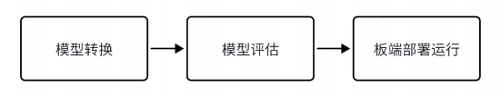

# RKNN2 开发流程

RKNN SDK 提供 C/C++ 和 Python 编程接口，用于将常见深度学习模型部署到 Rockchip NPU 平台。

RKNN2 开发流程分为三个阶段：

1. **模型转换**：在 x86_64 PC 上使用 RKNN-Toolkit2，将 Caffe、TensorFlow、TensorFlow Lite、ONNX、Darknet 或 PyTorch 模型转换为 RKNN 模型。
2. **模型评估**：完成量化、精度分析、连板性能分析和内存占用分析。
3. **板端部署**：通过 RKNPU2 C/C++ API 或 RKNN-Toolkit Lite2 Python API 加载 RKNN 模型，完成前处理、推理和后处理。



```text
原始模型
   ↓
RKNN-Toolkit2（PC）
   ├── 模型转换与量化
   ├── 精度与性能评估
   └── 导出 .rknn 模型
             ↓
RKNPU2 / RKNN-Toolkit Lite2（AIBOX-PRO）
             ↓
          RK3588 NPU
```

RKNN-Toolkit2 运行在 PC 端，不应安装在 AIBOX-PRO 板端。
