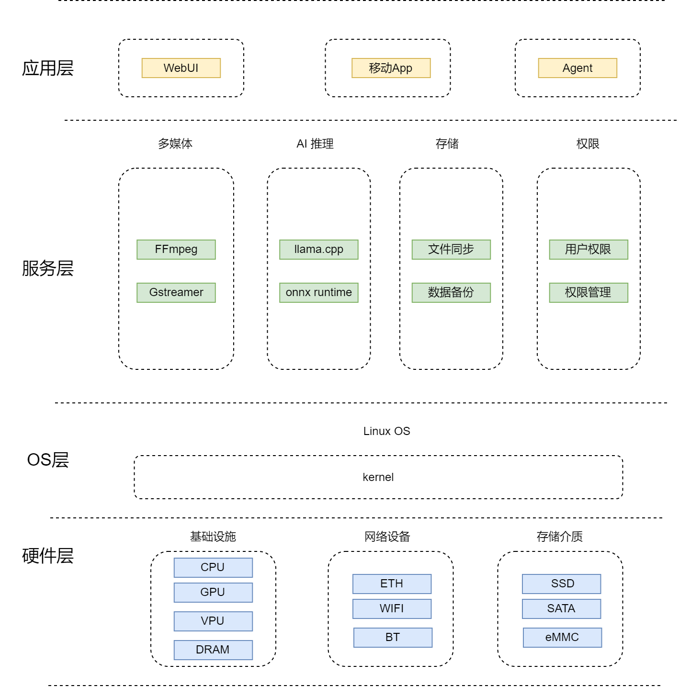
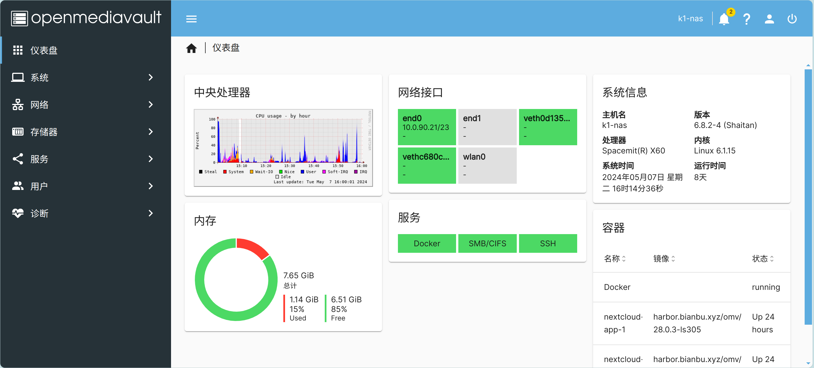
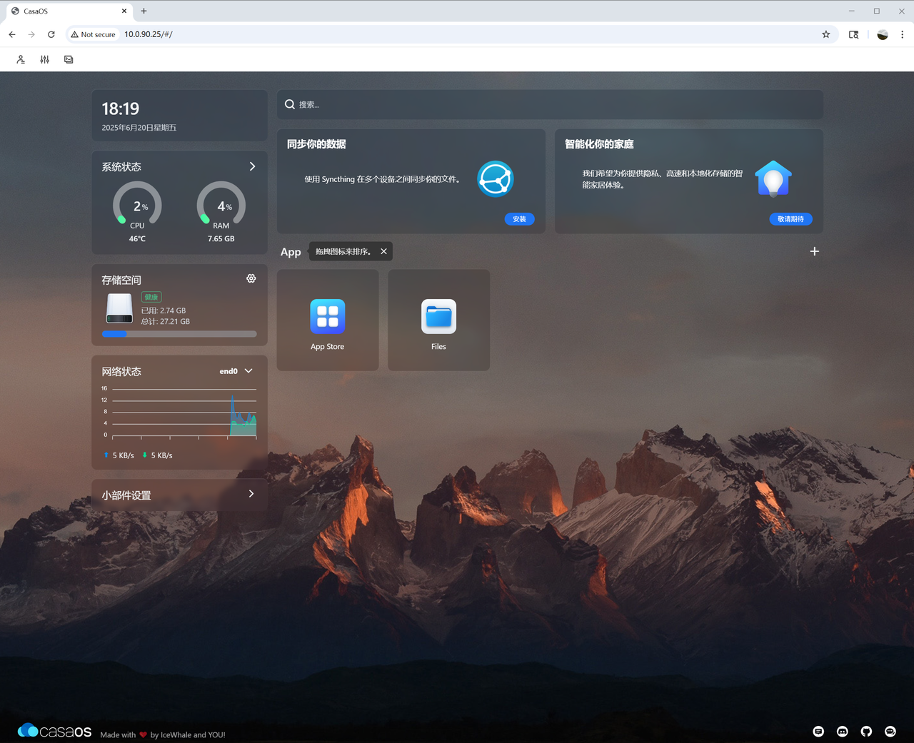

sidebar_position: 1

# AI NAS

**NAS**(Network Attached Storage)是以网络协议对外提供文件、对象、备份、媒体与应用服务的专用存储设备。**AI NAS**（AI Network Attached Storage）是在传统 NAS 存储功能基础上，融合本地 AI 推理能力的新型存储设备。区别于传统 NAS 仅提供文件存储与共享服务，AI NAS 可在本地完成图像识别、视频分析、智能检索、多模态问答等 AI 任务，数据无需上传云端，兼顾隐私保护与低延迟响应。

## 核心能力

- **图像智能**：图片自动分类与标签、人脸识别与相册聚合、以图搜图、EXIF 元数据提取。
- **视频智能**：视频内容分析与场景切割、智能剪辑与摘要生成、实时视频流目标检测与告警。
- **文档智能**：OCR 文字识别、PDF/Office 文档解析、语义向量化与全文检索。
- **本地问答**：大语言模型部署（RAG）、知识库管理、多轮对话与上下文记忆。
- **模型管理**：本地模型下载、版本切换、量化格式支持、CPU推理后端配置。


## 平台支持情况

| 平台 & 系统          | 是否支持 |
| -------------------- | -------- |
| K1 Buildroot         | ✅ 支持 |
| K1 OpenHarmony       | ❌ 不支持 |
| K1 Bianbu LXQT/GNOME | ✅ 支持 |
| K3 Buildroot         | ✅ 支持 |
| K3 OpenHarmony       | ❌ 不支持 |
| K3 Bianbu LXQT/GNOME | ✅ 支持   |

## 技术架构

### 系统架构图



## 开发环境

| 开发环境 | 适用场景 | 核心优势 |
|---------|---------|---------|
| Buildroot | 嵌入式固件、最小化系统镜像、轻量产品 | 镜像小、启动快、可控性高 |
| Debian | 功能验证、应用生态、高配产品 | APT/OMV/Docker 生态完整，开发便捷 |


### Buildroot开发环境

基于 Buildroot 构建的 Linux SDK，适配 SpacemiT K 系列芯片。包含监管程序接口（OpenSBI）、引导加载程序（U-Boot/UEFI）、Linux 内核、根文件系统（包含各种中间件和库）以及示例等。其目标是为客户提供处理器 Linux 支持，并且可以开发驱动或应用。

#### K1 Buildroot

[K1 Buildroot开发资料](https://www.spacemit.com/community/document/info?lang=zh&nodepath=software/SDK/buildroot/k1_buildroot)

[K1 Buildroot下载源码](https://www.spacemit.com/community/resources-download/SDK/K1/Buildroot)

#### K3 Buildroot

[K3 Buildroot开发资料](https://www.spacemit.com/community/document/info?lang=zh&nodepath=software/SDK/buildroot/k3_buildroot)

[K3 Buildroot下载源码](https://www.spacemit.com/community/resources-download/SDK/K3/Buildroot)

### Debian开发环境

Debian 开发环境基于 Bianbu OS（SpacemiT 官方 Debian 衍生发行版），Bianbu 是为 RISC-V 架构的处理器深度优化的操作系统，基于 Ubuntu 社区源码构建，为进迭时空 AI CPU 提供系统底座。Bianbu 为开发者和用户提供以下版本镜像：
- **GNOME 桌面版本**：原生桌面版，预装 GNOME Shell 桌面环境、Chromium、LibreOffice、MPV 等应用。
- **LXQt 桌面版本**：基于 LXQt 重新设计和开发的轻桌面，用于轻量级，对资源占用和性能有要求的场景。
- **Minimal版本**：最小系统版本，提供命令行界面。

Debian NAS方案基于Bianbu Minimal版本开发，其中K1 Bianbu 2.0基于Ubuntu 24.04社区版本构建，K3 Bianbu 4.0基于Ubuntu 26.04社区版本构建。

Bianbu开发环境和Buildroot开发环境共用bsp源码。

#### K1 Bianbu 镜像

[K1 Bianbu Minimal镜像](https://spacemit.com/community/resources-download/Images%20Collects/K1/Bianbu)

#### K3 Bianbu 镜像

[K3 Bianbu Minimal镜像](https://spacemit.com/community/resources-download/Images%20Collects/K3/Bianbu)

#### 定制镜像ROOTFS

[Bianbu ROOTFS制作](https://spacemit.com/community/document/info?lang=zh&nodepath=software/SDK/bianbu/system_integration)


## 多媒体功能开发

Spacemit平台的 VPU 基于 V4L2 框架实现，具有硬件视频编解码功能。
- **解码格式**：H.264 / HEVC / VP8 / VP9 / MJPEG / MPEG-4
- **编码格式**：H.264 / HEVC / VP8 / VP9 / MJPEG

### FFMPEG用户使用指南

[FFMPEG用户使用指南](https://www.spacemit.com/community/document/info?lang=zh&nodepath=software/SDK/buildroot/k3_buildroot/media/ffmpeg_user_guide.md)

### Gstreamer用户使用指南

[Gstreamer 用户使用指南](https://www.spacemit.com/community/document/info?lang=zh&nodepath=software/SDK/buildroot/k3_buildroot/media/gstreamer_user_guide.md)

## AI 功能开发

### AI 开发环境

#### Buildroot AI开发环境

Buildroot发布版本已集成llama.cpp，spacemit-onnxruntime。

#### Bianbu AI开发环境

安装llama.cpp
```bash
sudo apt update
sudo apt install llama.cpp-tools-spacemit
```

安装spacemit-onnxruntime
```bash
sudo apt-get update
sudo apt-get install -y spacemit-onnxruntime libopencv-dev python3-spacemit-ort python3-pillow python3-matplotlib python3-opencv
```

### AI 功能

AI NAS可参考Spacemit平台的智算平台[AI SDK](https://www.spacemit.com/community/document/info?lang=zh&nodepath=ai/application_tools/ai-sdk.md)，实现以下AI功能。

#### 智能媒体库

- **图片识别**：分类、目标检测、人脸检测、人脸特征、情绪识别、姿态识别。
- **视频分析**：抽帧、目标检测、多目标跟踪、关键帧摘要。
- **相册能力**：人物聚类、场景标签、重复图片识别、自然语言检索。
- **媒体问答**：VLM 根据图片生成描述，支持“这张图里有什么”“找出有猫的照片”等查询。

#### 私有知识库与RAG

- **文档接入**：PDF、TXT、Markdown、Office 文档、图片 OCR 后文本。
- **向量化**：按共享目录、用户、项目或标签生成知识库。
- **检索增强问答**：LLM SDK 的 /api/chat 支持传入 kb_ids，可对指定知识库进行 RAG 问答。
- **知识库管理**：LLM SDK 提供知识库创建、文件上传、向量化、进度查询、chunk 调试、删除等 API。
- **资产服务**：LLM SDK 的 Assets 接口可代理 MinIO 静态文件，并支持 Range 请求，适合文档、音频、图片预览。

#### 语音与会议中心

- **ASR**：音频文件转写，适合会议录音、家庭语音备忘、视频字幕生成。
- **TTS**：文本转语音，用于语音播报、无屏设备交互。
- **VAD**：语音活动检测，减少静音片段处理。
- **Voiceprint/说话人分离**：用于多说话人会议记录和家庭成员识别。

#### 本地AI助理

- **本地聊天**：LLM SDK、llama-server 或 Ollama 提供 OpenAI 兼容或 REST API。
- **模型管理**：下载、取消下载、启动、停止、切换当前模型、查询服务状态。
- **会话管理**：创建会话、消息历史、重命名会话、删除会话。
- **多模态问答**：VLM 支持图像描述、视觉问答、多轮图文对话。
- **Agent 扩展**：将 NAS 的文件搜索、相册检索、备份任务、下载任务、系统诊断封装为工具。

## 存储方案设计

### 磁盘识别与设备模型

建议开发中不要直接持久化 `/dev/sda`、`/dev/nvme0n1`：

- 磁盘唯一标识：优先 WWN/serial，兼容 USB 桥接芯片缺失 serial 的情况。
- 分区标识：使用 PARTUUID。
- 文件系统标识：使用 UUID/LABEL。
- Web UI 展示：型号、序列号、容量、接口、温度、SMART 状态、所在阵列。

### RAID 选择

| 模式 | 最少盘数 | 容量 | 冗余 | 适用场景 |
|---|---:|---|---|---|
| Single | 1 | 1 盘 | 无 | 入门、外置盘 |
| JBOD/Linear | 2 | 总和 | 无 | 容量优先，不建议存重要数据 |
| RAID0 | 2 | 总和 | 无 | 临时高速缓存 |
| RAID1 | 2 | 1 盘 | 1 盘 | 家用双盘 NAS 首选 |
| RAID5 | 3 | N-1 | 1 盘 | 多盘容量与冗余平衡 |
| RAID6 | 4 | N-2 | 2 盘 | 大容量盘、重建时间长的场景 |
| RAID10 | 4 | N/2 | 每组 1 盘 | 性能与恢复速度优先 |

建议：

- 新建 MD RAID 使用整块裸盘或标准 GPT 分区，保持所有成员盘容量一致。
- RAID 元数据使用 1.2，特殊启动分区场景再评估 1.0。
- RAID5/6 重建期间必须限制后台任务并提示性能下降。
- USB 连接的数据盘不建议组成生产 RAID。

### 文件系统选择

| 文件系统 | 优势 | 风险/限制 | 推荐用途 |
|---|---|---|---|
| ext4 | 稳定、恢复工具成熟、资源占用低 | 快照能力弱 | 默认通用数据盘 |
| xfs | 大文件与并发性能好 | 缩容困难 | 视频、备份、大文件 |
| btrfs | COW、快照、校验、压缩 | 运维复杂度高，RAID5/6 慎用 | 快照/轻量数据保护 |
| zfs | 数据完整性强、快照强 | 内核模块和内存要求高 | Debian 高配/插件路线 |

### 共享目录与权限

权限策略：

- Linux 层使用用户/组和 POSIX ACL。
- SMB 层启用 `vfs objects = acl_xattr recycle streams_xattr`。
- NFS 依赖 UID/GID 映射，不作为互联网暴露服务。
- 家目录共享单独启用，避免和公共共享混用。

### SMART 与健康监控

监控项：

- SMART overall-health。
- 温度、通电时间、重映射扇区、待映射扇区、不可校正错误。
- NVMe media errors、percentage used、critical warning。
- RAID 状态：clean/degraded/recovering/resync。
- 文件系统只读、挂载失败、I/O error。

告警分级：

- P0：阵列降级、双盘错误、文件系统只读。
- P1：SMART failed、坏扇区增长、温度过高。
- P2：容量超过 85%、单服务异常、备份失败。

## 网络方案设计

### 基础网络

- 默认 DHCP，Web UI 支持静态 IP。
- 支持 IPv4/IPv6 双栈，IPv6 默认不暴露管理接口到公网。
- mDNS 主机名：`nas-dev.local`。
- Windows 发现：wsdd2，减少 SMB1/NetBIOS 依赖。
- MTU 默认 1500，2.5G/10G 内网可选 Jumbo Frame，但必须全链路一致。

### 高级网络

- Bonding：active-backup 用于可靠性，802.3ad 需要交换机 LACP。
- VLAN：企业/实验室多网段隔离。
- 防火墙：默认只开放 Web、SSH、SMB、NFS、rsync、Docker 映射端口。
- 服务绑定：管理服务可限制监听 LAN 口，不监听 WAN/热点口。

### 性能调优

检查项：

```bash
ethtool eth0
ethtool -k eth0
ip -s link show eth0
ss -tulpn
```

可评估项：

- TCP 拥塞控制：`bbr` 或 `cubic`。
- 网卡 offload：GRO/GSO/TSO/RSS。
- Samba 参数：`server multi channel support`、`aio read/write size`、`socket options` 慎用。
- IRQ 绑核与 RPS/XPS：高吞吐平台再做。

## 性能测试

### AI 性能

- Vision：单帧推理耗时、FPS、CPU/TCM 占用、模型加载时间。
- ASR：RTF、转写准确率抽检、长音频稳定性。
- TTS：首包延迟、合成速度、音频质量抽检。
- LLM：prefill tokens/s、decode tokens/s、首 token 延迟、上下文长度、并发数。
- RAG：文档解析速度、向量化速度、召回准确性、问答延迟。
- 系统影响：SMB/NFS 吞吐下降比例、磁盘队列、温度、内存峰值。

### 存储基础测试

| ID | 用例 | 步骤 | 期望 |
|---|---|---|---|
| ST-001 | 磁盘识别 | 插入 SATA/NVMe/USB 盘，执行 `lsblk -J`, `blkid` | 型号、容量、序列号、接口正确 |
| ST-002 | 分区格式化 | GPT 新建分区，格式化 ext4/xfs/btrfs | 成功挂载到 `/srv/poolX` |
| ST-003 | UUID 挂载 | 重启 3 次，交换插盘顺序 | 挂载路径稳定 |
| ST-004 | 热插拔 | USB 盘插拔 20 次 | 无 kernel panic，UI 状态刷新 |
| ST-005 | 文件系统满盘 | 写入至 95%/100% | 告警触发，服务不崩溃 |
| ST-006 | 掉电恢复 | 写入中断电，重启 fsck/mount | 数据盘可恢复或明确进入维护态 |

### RAID 测试

| ID | 用例 | 步骤 | 期望 |
|---|---|---|---|
| RD-001 | RAID1 创建 | 两盘创建 RAID1，格式化挂载 | `/proc/mdstat` clean |
| RD-002 | RAID5 创建 | 三盘创建 RAID5 | 同步完成后状态 clean |
| RD-003 | 降级读写 | RAID1/5 拔一盘，继续 SMB 写入 | 服务可用，告警 P0 |
| RD-004 | 替换重建 | 插入新盘执行 recover | 重建完成，数据校验通过 |
| RD-005 | 重启组装 | RAID 创建后重启 | mdadm 自动 assemble |
| RD-006 | 异盘导入 | 其他 Linux 创建阵列后迁入 | 能识别并挂载，UI 提示导入 |

常用命令：

```bash
cat /proc/mdstat
mdadm --detail /dev/md0
mdadm --examine /dev/sdX
```

### SMART 测试

| ID | 用例 | 步骤 | 期望 |
|---|---|---|---|
| SM-001 | SMART 读取 | `smartctl -a /dev/sdX` | 能解析健康状态和温度 |
| SM-002 | 短测 | `smartctl -t short /dev/sdX` | 任务可启动，结果可查询 |
| SM-003 | NVMe 健康 | `smartctl -a /dev/nvme0` | critical warning 等字段正确 |
| SM-004 | 告警模拟 | 使用测试盘或 mock 输出坏扇区 | UI/邮件/日志告警 |

### 本地 I/O 性能测试

NAS 存储性能测试建议按“块设备、文件系统、协议共享”三层拆开。块设备测试用于判断盘和控制器上限；文件系统测试用于验证 ext4/xfs/btrfs、RAID、缓存和挂载参数；SMB/NFS 测试用于验证最终用户体验。

测试前准备：

```bash
# 查看设备、挂载点、文件系统和调度器
lsblk -o NAME,TYPE,SIZE,MODEL,TRAN,MOUNTPOINT,FSTYPE
df -hT
cat /sys/block/<dev>/queue/scheduler

# 确认测试目录有足够空间，建议测试文件大小大于内存容量的 2 倍
mkdir -p /srv/pool1/test
```

记录项：

- 设备信息：磁盘型号、接口、文件系统、RAID 级别、挂载参数。
- 系统状态：CPU、内存、温度、I/O wait、RAID rebuild 状态。
- 性能指标：吞吐、IOPS、平均延迟、P95/P99/P99.9 延迟。
- 测试参数：块大小、队列深度、并发数、文件大小、direct I/O、运行时间。

#### dd 基础顺序读写

`dd` 适合快速冒烟测试，优点是系统自带概率高；缺点是指标较少，不能替代 fio/iozone/vdbench。

文件系统顺序写：

```bash
dd if=/dev/zero of=/srv/pool1/test/dd_write.bin bs=1M count=8192 \
  conv=fdatasync status=progress
```

文件系统顺序读：

```bash
sync
echo 3 > /proc/sys/vm/drop_caches
dd if=/srv/pool1/test/dd_write.bin of=/dev/null bs=4M status=progress
```

direct I/O 读写：

```bash
dd if=/dev/zero of=/srv/pool1/test/dd_direct.bin bs=1M count=8192 \
  oflag=direct status=progress

dd if=/srv/pool1/test/dd_direct.bin of=/dev/null bs=4M \
  iflag=direct status=progress
```

块设备只读参考测试：

```bash
dd if=/dev/nvme0n1 of=/dev/null bs=16M count=256 iflag=direct status=progress
```

注意：

- 不要对有数据的块设备执行 `of=/dev/sdX` 写入测试，除非明确是可销毁测试盘。
- 某些文件系统或设备对 `iflag=direct`/`oflag=direct` 支持不完整，失败时记录错误并改用 drop cache 后普通读。
- 测试完成删除临时文件：`rm -f /srv/pool1/test/dd_*.bin`。

#### fio 综合 I/O 测试

fio 是 NAS 开发中最推荐的通用 I/O 性能工具，适合顺序、随机、混合、延迟和长稳测试。

顺序写：

```bash
fio --name=seqwrite --directory=/srv/pool1/test --rw=write --bs=1M \
  --size=8G --numjobs=1 --iodepth=16 --direct=1 --time_based=0 \
  --group_reporting --output-format=json --output=seqwrite.json
```

顺序读：

```bash
fio --name=seqread --directory=/srv/pool1/test --rw=read --bs=1M \
  --size=8G --numjobs=1 --iodepth=16 --direct=1 \
  --group_reporting --output-format=json --output=seqread.json
```

4K 随机读：

```bash
fio --name=randread --directory=/srv/pool1/test --rw=randread --bs=4k \
  --size=4G --numjobs=4 --iodepth=32 --direct=1 --runtime=300 \
  --time_based --group_reporting --output-format=json \
  --output=randread.json
```

4K 随机写：

```bash
fio --name=randwrite --directory=/srv/pool1/test --rw=randwrite --bs=4k \
  --size=4G --numjobs=4 --iodepth=32 --direct=1 --runtime=300 \
  --time_based --group_reporting --output-format=json \
  --output=randwrite.json
```

4K 随机混合读写：

```bash
fio --name=randrw --directory=/srv/pool1/test --rw=randrw --rwmixread=70 \
  --bs=4k --size=4G --numjobs=4 --iodepth=32 --direct=1 \
  --runtime=300 --time_based --group_reporting --output-format=json \
  --output=randrw.json
```

多文件多客户端模拟：

```bash
fio --name=multiuser --directory=/srv/pool1/test --rw=randrw --rwmixread=80 \
  --bs=64k --size=2G --numjobs=16 --iodepth=8 --direct=1 \
  --runtime=600 --time_based --group_reporting \
  --output-format=json --output=multiuser.json
```

延迟优先测试：

```bash
fio --name=latency --directory=/srv/pool1/test --rw=randread --bs=4k \
  --size=4G --numjobs=1 --iodepth=1 --direct=1 --runtime=300 \
  --time_based --group_reporting --output-format=json \
  --output=latency.json
```

块设备测试示例：

```bash
# 只读测试可直接使用块设备
fio --name=devread --filename=/dev/nvme0n1 --rw=read --bs=1M \
  --iodepth=32 --direct=1 --runtime=120 --time_based \
  --group_reporting --readonly --output-format=json --output=devread.json
```

注意：

- 对块设备做写入测试会破坏数据，必须只用于空盘或专用测试盘。
- `--size` 应大于内存，避免结果被 page cache 放大。
- 建议保留 JSON 输出，后续可自动提取 `bw_bytes`、`iops`、`lat_ns.percentile`。

#### iozone 文件系统测试

iozone 适合做文件系统矩阵测试，覆盖 write/rewrite/read/reread/random read/random write，并能生成二维结果表。

自动模式：

```bash
iozone -a -i 0 -i 1 -i 2 -s 8G -r 4k -r 64k -r 1M \
  -f /srv/pool1/test/iozone.test \
  -Rb /srv/pool1/test/iozone_result.xls
```

direct I/O 模式：

```bash
iozone -a -I -i 0 -i 1 -i 2 -s 8G -r 4k -r 64k -r 1M \
  -f /srv/pool1/test/iozone_direct.test \
  -Rb /srv/pool1/test/iozone_direct_result.xls
```

多线程吞吐：

```bash
iozone -t 8 -i 0 -i 1 -i 2 -s 2G -r 1M \
  -F /srv/pool1/test/ioz1 /srv/pool1/test/ioz2 /srv/pool1/test/ioz3 /srv/pool1/test/ioz4 \
     /srv/pool1/test/ioz5 /srv/pool1/test/ioz6 /srv/pool1/test/ioz7 /srv/pool1/test/ioz8
```

关注指标：

- 初次 write 与 rewrite 的差距，用于判断缓存和覆盖写性能。
- read 与 reread 的差距，用于判断 page cache 影响。
- random read/write 在 4K/64K 下的 IOPS 和延迟表现。

#### vdbench 企业级压力测试

vdbench 适合做长时间、可重复、可描述的存储压力测试，常用于 RAID、文件系统、NAS 协议和多工作负载混合测试。

块设备只读配置 `vdbench_block_read.conf`：

```text
sd=sd1,lun=/dev/nvme0n1,openflags=o_direct
wd=wd1,sd=sd1,xfersize=1m,rdpct=100,seekpct=0
rd=rd1,wd=wd1,iorate=max,elapsed=300,interval=1
```

文件系统顺序写配置 `vdbench_fs_write.conf`：

```text
fsd=fsd1,anchor=/srv/pool1/test/vdbench,depth=2,width=4,files=64,size=256m
fwd=fwd1,fsd=fsd1,operation=write,xfersize=1m,fileio=sequential,fileselect=random,threads=8
rd=rd1,fwd=fwd1,fwdrate=max,elapsed=300,interval=1
```

文件系统混合读写配置 `vdbench_fs_mix.conf`：

```text
fsd=fsd1,anchor=/srv/pool1/test/vdbench,depth=2,width=8,files=128,size=128m
fwd=fwd1,fsd=fsd1,operation=read,xfersize=64k,fileio=random,fileselect=random,threads=8
fwd=fwd2,fsd=fsd1,operation=write,xfersize=64k,fileio=random,fileselect=random,threads=4
rd=rd1,fwd=(fwd1 fwd2),fwdrate=max,elapsed=1800,interval=5
```

执行：

```bash
vdbench -f vdbench_fs_mix.conf -o /srv/pool1/test/vdbench_out
```

注意：

- vdbench 需要 Java 运行环境。
- 块设备写入同样会破坏数据，量产测试优先使用文件系统模式。
- 长稳测试建议至少 1-24 小时，配合温度、SMART、RAID、dmesg 监控。

### 网络吞吐测试

NAS 网络测试建议覆盖 TCP 吞吐、UDP 丢包/抖动、请求响应延迟、多连接并发、长时间稳定性和协议栈 CPU 占用。测试前确认链路速率、双工、MTU 和 offload 状态：

```bash
ip -br addr
ip -s link show <iface>
ethtool <iface>
ethtool -k <iface>
ss -tulpn
```

#### iperf3 测试方法

iperf3 适合 TCP/UDP 吞吐、反向、双向和多流测试，是 NAS 网络验收首选工具。

服务端：

```bash
iperf3 -s
```

客户端上行：

```bash
iperf3 -c <NAS_IP> -t 60 -P 4 -J > iperf_upload.json
```

客户端下行，即 NAS 到客户端：

```bash
iperf3 -c <NAS_IP> -t 60 -P 4 -R -J > iperf_download.json
```

双向同时收发：

```bash
iperf3 -c <NAS_IP> -t 60 -P 4 --bidir -J > iperf_bidir.json
```

单连接 TCP 基线：

```bash
iperf3 -c <NAS_IP> -t 60 -P 1 -J > iperf_tcp_p1.json
```

多连接 TCP：

```bash
iperf3 -c <NAS_IP> -t 60 -P 8 -J > iperf_tcp_p8.json
```

UDP 抖动/丢包：

```bash
iperf3 -c <NAS_IP> -u -b 900M -t 60 -J > iperf_udp.json
```

UDP 阶梯压测：

```bash
for rate in 100M 300M 600M 900M; do
  iperf3 -c <NAS_IP> -u -b $rate -t 60 -J > iperf_udp_${rate}.json
done
```

长时间稳定性：

```bash
iperf3 -c <NAS_IP> -t 3600 -P 4 -J > iperf_1h.json
```

MTU/Jumbo Frame 对比：

```bash
ip link set <iface> mtu 1500
iperf3 -c <NAS_IP> -t 60 -P 4 -J > iperf_mtu1500.json

ip link set <iface> mtu 9000
iperf3 -c <NAS_IP> -t 60 -P 4 -J > iperf_mtu9000.json
```

注意：MTU 必须 NAS、客户端、交换机全链路一致，否则容易出现丢包或性能下降。

#### netperf 测试方法

netperf 适合补充 TCP/UDP 吞吐和请求响应类测试，尤其是 `TCP_RR` 可用于观察小包请求/响应延迟。

NAS 端启动服务：

```bash
netserver -D -p 12865
```

TCP 上行，即客户端到 NAS：

```bash
netperf -H <NAS_IP> -p 12865 -l 60 -t TCP_STREAM -- -m 64K
```

TCP 下行，即 NAS 到客户端：

```bash
netperf -H <NAS_IP> -p 12865 -l 60 -t TCP_MAERTS -- -m 64K
```

TCP 请求响应延迟：

```bash
netperf -H <NAS_IP> -p 12865 -l 60 -t TCP_RR -- -r 1,1
netperf -H <NAS_IP> -p 12865 -l 60 -t TCP_RR -- -r 64K,64K
```

UDP 吞吐：

```bash
netperf -H <NAS_IP> -p 12865 -l 60 -t UDP_STREAM -- -m 1472
```

多进程并发：

```bash
for i in 1 2 3 4 5 6 7 8; do
  netperf -H <NAS_IP> -p 12865 -l 60 -t TCP_STREAM -- -m 64K > netperf_$i.log &
done
wait
```

结果关注：

- `Throughput`：吞吐能力。
- `Trans/s`：请求响应事务数，适合小包 RPC/元数据场景。
- CPU 占用和软中断：`mpstat`, `top`, `/proc/interrupts`。

#### 网络测试组合建议

| 测试目标 | 工具 | 推荐命令 |
|---|---|---|
| 单连接 TCP 基线 | iperf3 | `iperf3 -c <NAS_IP> -t 60 -P 1 -J` |
| 多连接吞吐 | iperf3 | `iperf3 -c <NAS_IP> -t 60 -P 4/8 -J` |
| 下行吞吐 | iperf3 | `iperf3 -c <NAS_IP> -R -P 4 -J` |
| 双向吞吐 | iperf3 | `iperf3 -c <NAS_IP> --bidir -P 4 -J` |
| UDP 丢包/抖动 | iperf3 | `iperf3 -u -b <rate> -J` |
| 小包请求响应 | netperf | `netperf -t TCP_RR -- -r 1,1` |
| NAS 发包能力 | netperf | `netperf -t TCP_MAERTS` |
| 长稳 | iperf3/netperf | `-t 3600` 或 `-l 3600` |

验收建议：

- 1GbE：TCP 单向接近线速，长期测试无丢包/断流。
- 2.5GbE/10GbE：记录 CPU 软中断占用，确认瓶颈在网络、存储还是协议栈。
- Jumbo Frame：分别测试 MTU 1500/9000，只有全链路稳定才允许默认开启。
- 网络测试报告应记录：链路速率、MTU、客户端配置、交换机型号、测试方向、并发数、CPU 占用、丢包和重传。

### SMB/NFS 协议测试

SMB：

```bash
smbclient -L //<NAS_IP> -U admin
smbclient //<NAS_IP>/public -U admin -c "put test.bin; get test.bin out.bin"
```

Windows 客户端：

```powershell
net use Z: \\<NAS_IP>\public /user:admin <password>
robocopy C:\test Z:\test /E /MT:8
```

NFS：

```bash
sudo mount -t nfs4 <NAS_IP>:/public /mnt/nas
dd if=/dev/zero of=/mnt/nas/test.bin bs=1M count=4096 conv=fdatasync
```

测试点：

- 多用户权限隔离。
- 大文件、海量小文件、中文文件名、长路径。
- macOS resource fork、Windows ACL、Linux uid/gid。
- 断网恢复、NAS 重启后客户端重连。

### 稳定性与压力

| ID | 用例 | 持续时间 | 关注点 |
|---|---:|---:|---|
| STB-001 | SMB 连续读写 | 24h | 吞吐波动、内存泄漏 |
| STB-002 | RAID 重建 + SMB 写入 | 至重建完成 | 重建速度、服务可用 |
| STB-003 | Docker 应用 + 文件共享并发 | 24h | I/O 争用、端口冲突 |
| STB-004 | 断电/重启循环 | 100 次 | 自动挂载、服务恢复 |
| STB-005 | 多客户端并发 | 8/16/32 客户端 | 连接数、锁冲突 |

## 模型移植

### inswapper移植示例
基于 InsightFace 的 inswapper_128.onnx，是一个人脸替换（Face Swap）模型。移植inswapper 到bianbu 4.0 系统AI SDK。

实现内容包括：
- 人脸检测：det_10g.onnx
- 人脸特征提取：w600k_r50.onnx
- 换脸生成：inswapper_128.onnx
- embedding 映射矩阵：inswapper_128.emap.bin
- XSlim INT8 量化检测/识别模型
- 使用 SpaceMITExecutionProvider 运行验证

AI SDK下载

```bash
git clone --recurse-submodules https://github.com/spacemit-com/ai-sdk.git
```

构建工程

vision/examples/CMakeLists.txt

```bash
add_model_example(inswapper inswapper)
```

inswapper目录结构：

```bash
vision/examples/inswapper/
├── README.md
├── config/
│   ├── inswapper.yaml
│   └── inswapper_xslim_int8_spacemit.yaml
├── cpp/
│   └── inswapper.cpp
└── scripts/
    ├── download_models.sh
    ├── prepare_xslim_calib.py
    └── xslim_quantize.py
```

下载模型

```bash
cd ai-sdk
bash vision/examples/inswapper/scripts/download_models.sh
```

默认FP32配置

vision/examples/inswapper/config/inswapper.yaml

```bash
det_model_path: ~/.cache/models/vision/inswapper/buffalo_l/det_10g.onnx
rec_model_path: ~/.cache/models/vision/inswapper/buffalo_l/w600k_r50.onnx
swap_model_path: ~/.cache/models/vision/inswapper/inswapper_128.onnx
emap_path: ~/.cache/models/vision/inswapper/inswapper_128.emap.bin
test_image: ~/.cache/assets/inswapper/t1.jpg
output_path: inswapper_result.jpg
det_size: [640, 640]
source_index: 2
target_index: -1
default_params:
  det_threshold: 0.5
  nms_threshold: 0.4
  num_threads: 4
  providers:
    - CPUExecutionProvider
```

XSlim INT8 量化

准备校准数据

```bash
python3 vision/examples/inswapper/scripts/prepare_xslim_calib.py
```

生成 XSlim JSON 配置

```bash
python3 vision/examples/inswapper/scripts/xslim_quantize.py
```

执行量化

```bash
python3 -m xslim -c models/inswapper/xslim_quant/det_10g.xslim.int8.json
python3 -m xslim -c models/inswapper/xslim_quant/w600k_r50.xslim.int8.json
```

XSlim + SpaceMIT EP 配置

```bash
# InsightFace INSwapper demo with XSlim INT8 detector/recognizer and SpaceMIT EP.
det_model_path: ~/.cache/models/vision/inswapper/xslim_quant/det_10g.xslim.int8.onnx
rec_model_path: ~/.cache/models/vision/inswapper/xslim_quant/w600k_r50.xslim.int8.onnx
swap_model_path: ~/.cache/models/vision/inswapper/inswapper_128.onnx
emap_path: ~/.cache/models/vision/inswapper/inswapper_128.emap.bin
test_image: ~/.cache/assets/inswapper/t1.jpg
output_path: inswapper_result_xslim_spacemit.jpg
det_size: [640, 640]
source_index: 2
target_index: -1
default_params:
  det_threshold: 0.5
  nms_threshold: 0.4
  num_threads: 4
  det_provider: CPUExecutionProvider
  rec_provider: SpaceMITExecutionProvider
  swap_provider: SpaceMITExecutionProvider
  providers:
    - SpaceMITExecutionProvider
```

构建

```bash
cd ai-sdk
./build/build.sh package vision
```

CPU FP32验证

```bash
source build/envsetup.sh
inswapper vision/examples/inswapper/config/inswapper.yaml \
  --output /home/bianbu/codex/ai-sdk/inswapper_result.jpg
```

XSlim INT8 + SpaceMIT EP 验证

```bash
source build/envsetup.sh
inswapper vision/examples/inswapper/config/inswapper_xslim_int8_spacemit.yaml \
  --output /home/bianbu/codex/ai-sdk/inswapper_result_xslim_spacemit.jpg
```

## 第三方应用移植

### Jellyfin移植示例
Jellyfin 是一个开源的媒体服务器，支持电影、电视剧、音乐、图书、照片等多种媒体类型。支持多端访问，支持多用户账号。Jellyfin 官方不提供 RISC-V 预编译包，基于bianbu 4.0 系统移植Jellyfin（版本jellyfin v10.11.11）

下载dotnet riscv64预编译包

```bash
wget https://github.com/dkurt/dotnet_riscv/releases/download/v9.0.100/dotnet-sdk-9.0.100-linux-riscv64-gcc-ubuntu-24.04.tar.gz
```

安装dotnet

```bash
sudo mkdir -p /usr/local/dotnet
tar -zxvf dotnet-sdk-9.0.100-linux-riscv64-gcc-ubuntu-24.04.tar.gz -C /usr/local/dotnet
```

移植SkiaSharp

```bash
git clone --depth 1 -b v3.116.1 https://github.com/mono/SkiaSharp.git
cd SkiaSharp
git submodule update --init --recursive

cd externals/skia
python3 tools/git-sync-deps
```

[编译参考文档](https://github.com/mono/SkiaSharp/blob/main/documentation/dev/building-linux.md)


移植Jellyfin web

```bash
git clone https://github.com/jellyfin/jellyfin-web.git
git checkout tags/v10.11.11
```

移植Jellyfin server

```bash
git clone https://github.com/jellyfin/jellyfin.git
git checkout tags/v10.11.11
```

部署

```bash
rsync -a --delete /tmp/jellyfin-publish/ /opt/jellyfin/bin/
```

启动Jellyfin server

```bash
sudo systemctl start jellyfin
```

构建Docker

目录结构

```bash
/opt/jellyfin/docker/
├── Dockerfile
├── .dockerignore
├── dotnet/          # .NET 9 运行时（shared/ + host/ + dotnet 二进制）
├── bin/             # Jellyfin server 程序
└── web/             # Jellyfin web 前端
```

Dockerfile

```bash
FROM ubuntu:24.04

ENV DEBIAN_FRONTEND=noninteractive

# 基础运行时依赖
RUN apt-get update && apt-get install -y --no-install-recommends \
    ca-certificates \
    libicu74 \
    libssl3 \
    libfontconfig1 \
    libfreetype6 \
    ffmpeg \
    && rm -rf /var/lib/apt/lists/*

# 创建运行用户
RUN groupadd -r jellyfin && useradd -r -g jellyfin -s /bin/false jellyfin

# 复制 .NET 9 运行时（仅 shared/host，排除 sdk/packs/templates）
COPY dotnet/shared /opt/dotnet/shared
COPY dotnet/host /opt/dotnet/host
COPY dotnet/dotnet /opt/dotnet/dotnet

# 复制 Jellyfin 程序和 Web
COPY bin/ /opt/jellyfin/bin/
COPY web/ /opt/jellyfin/web/

# 创建数据目录并设置权限
RUN mkdir -p \
    /var/lib/jellyfin \
    /var/cache/jellyfin \
    /var/log/jellyfin \
    /etc/jellyfin \
    && chown -R jellyfin:jellyfin \
    /var/lib/jellyfin \
    /var/cache/jellyfin \
    /var/log/jellyfin \
    /etc/jellyfin \
    /opt/jellyfin \
    /opt/dotnet

ENV DOTNET_ROOT=/opt/dotnet
ENV DOTNET_CLI_TELEMETRY_OPTOUT=1
ENV DOTNET_NOLOGO=1
ENV ASPNETCORE_URLS=http://+:8096

EXPOSE 8096

VOLUME ["/var/lib/jellyfin", "/var/cache/jellyfin", "/var/log/jellyfin", "/etc/jellyfin"]

USER jellyfin

ENTRYPOINT ["/opt/dotnet/dotnet", "/opt/jellyfin/bin/jellyfin.dll", \
    "--datadir", "/var/lib/jellyfin", \
    "--cachedir", "/var/cache/jellyfin", \
    "--logdir", "/var/log/jellyfin", \
    "--configdir", "/etc/jellyfin", \
    "--webdir", "/opt/jellyfin/web"]
```


## 开源NAS系统

### OpenMediaVault

OpenMediaVault（简称 OMV）是一个基于 Debian Linux 的开源网络附加存储（NAS）系统，由 Volker Theile 开发和维护。专为家庭和小型办公环境设计的 NAS 操作系统，通过 Web 界面管理存储和网络服务。


[源码路径](https://github.com/openmediavault/openmediavault)

[Bianbu OMV开发说明文档](https://gitee.com/bianbu/nas-docs)

基于Bianbu系统移植的openmediavault


### CasaOS

CasaOS 是由国内团队 IceWhale Technology（冰鲸科技） 开发的开源个人云系统，定位为比 OMV 更轻量、更易用的家庭云平台。


[源码路径](https://github.com/IceWhaleTech/CasaOS)

[CasaOS开发说明文档](https://wiki.casaos.io/zh/contribute/development)

基于Bianbu系统移植的CasaOS



## 技术支持

- **官方文档**：https://www.spacemit.com/community/document
- **开发者社区**：https://www.spacemit.com/community
- **问题反馈**：通过社区论坛或 GitLab Issues 提交
