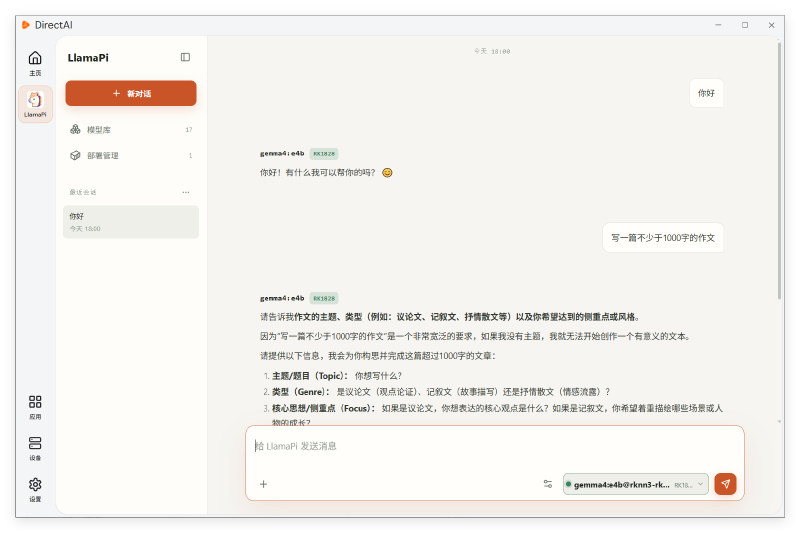

# LlamaPi

LlamaPi 是一款大模型部署与管理应用：在设备上发现、下载并运行本地大模型，并通过 OpenAI 兼容 API 为第三方应用提供推理能力。

LlamaPi 致力于降低端侧大模型与本地 Agent 的落地门槛，把模型下载、格式转换、NPU 推理、服务接口能力进行封装。无论是快速做技术原型验证，还是搭建离线私有化 AI 业务，都可以借助 LlamaPi 缩短开发周期。

## 模型管理

LlamaPi 具备完整的模型管理能力，帮助开发者完成模型的查询、下载与清理，不必手动维护零散的权重文件。用户可以直接在 LlamaPi 桌面客户端界面浏览模型库，点选即可完成模型下载、查看本地模型、删除闲置模型等全部管理操作。

## 部署管理

LlamaPi 提供完整的部署管理能力，方便开发者灵活调度本地大模型服务。用户可以在桌面客户端中直接对已下载模型执行加载、卸载、设置开机自启等操作，直观查看当前模型运行状态。

## 模型对话

模型加载完成后，在聊天界面中直接与模型对话验证效果；也可以通过 OpenAI 兼容 API 将模型接入自己的应用。

## 相关文档

- 安装与使用：[LlamaPi 使用文档](../../LlamaPi/llamapi/introduction.md)
- 在 DirectAI 中安装应用：[安装应用](../getting-started/install-app.md)
