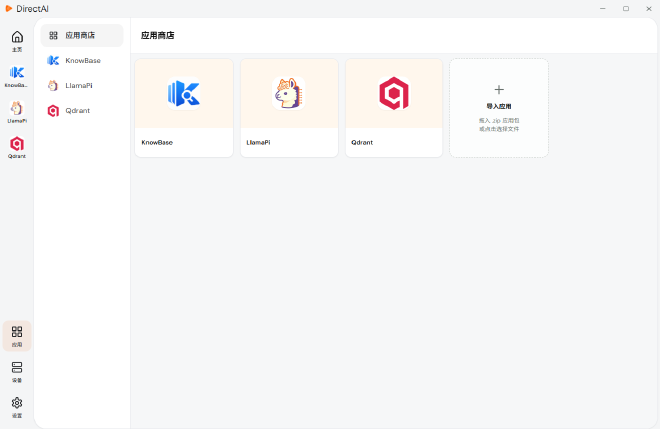

# 安装应用

阅读本节，在 DirectAI 中安装、更新和卸载应用。

## 从应用商店安装

1. 从应用管理页中打开「应用商店」。

2. 在应用列表中选择目标应用，进入应用详情页查看介绍和版本信息。当前商店提供的应用见[应用介绍](../app-intro/index.md)。

3. 点击安装。客户端会自动完成应用部署，安装完成后应用出现在侧边栏，点击即可打开使用。

## 导入本地应用包

拿到应用安装文件时，可以直接拖入应用商店窗口导入：

- 新应用：提示「已导入应用，已加入应用商店」。
- 同名应用：提示替换应用商店中的已有版本，确认后完成更新。

## 更新与卸载

- **更新**：导入新版本的应用安装文件，在商店中确认替换。
- **卸载**：在应用商店或应用详情页执行卸载，应用会从客户端和设备中一并移除。

## 下一步

- 商店应用的功能介绍：[应用介绍](../app-intro/index.md)
- 设备连不上或应用安装失败：[常见问题与故障排查](../directai/faq.md)
