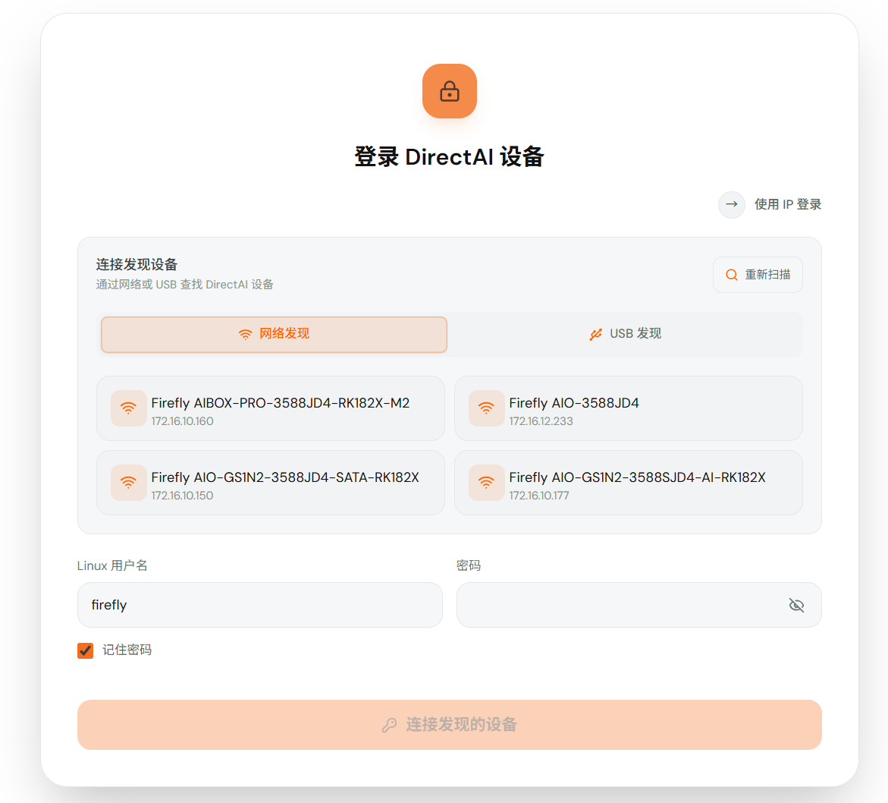
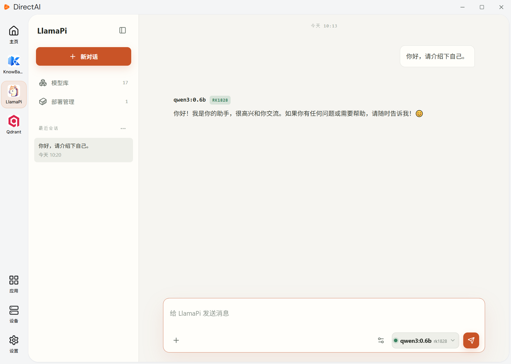
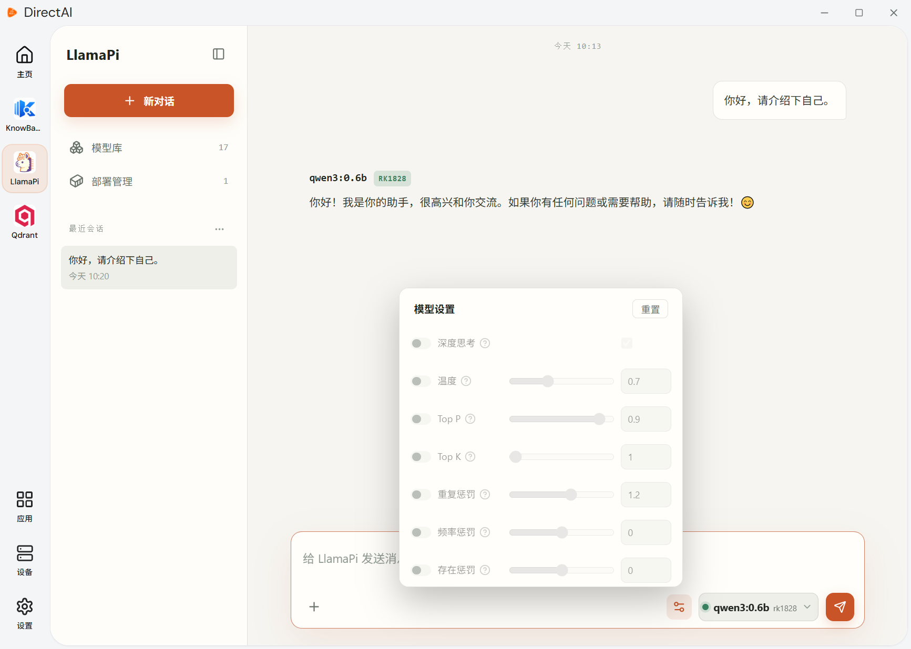
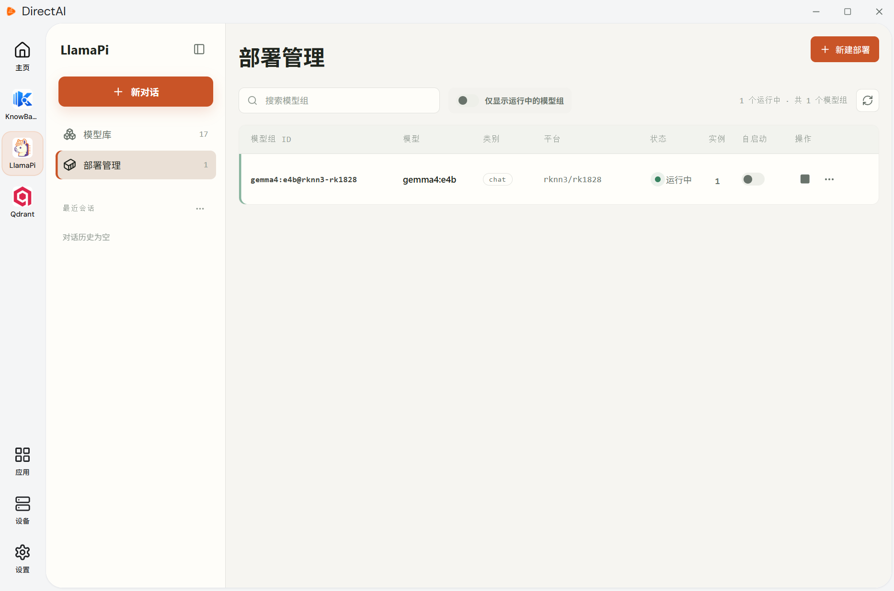
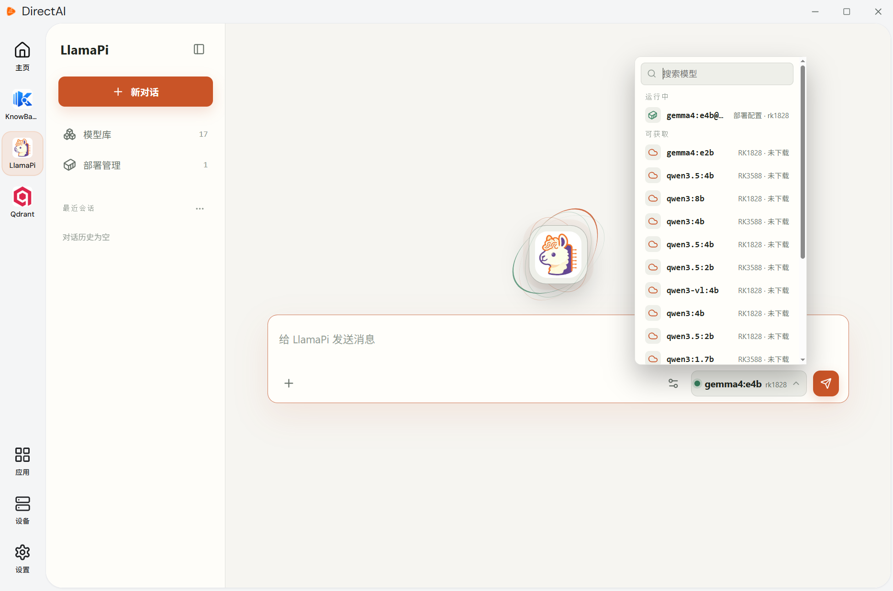

# 客户端的使用

除命令行外，LlamaPi 提供 Windows 客户端。客户端可以完成入门教程中的所有操作：下载、加载、运行和部署模型，并在客户端中与模型对话。

## DirectAI客户端

LlamaPi 客户端应用需要运行在 DirectAI 平台上，DirectAI安装包从[ Firefly 官网下载页](https://community.t-firefly.com/doc/download/429)获取。参考[DirectAI文档](https://community.t-firefly.com/docs/ai/applications/DirectAI/directai/introduction)安装完成后打开客户端，DirectAI 会自动扫描局域网内的设备，点击要使用的设备进行连接：

## 与模型对话
在新对话页面选择模型进行对话，LlamaPi会自动下载和加载模型：

模型准备就绪后就会进行模型推理，并返回推理结果：

与模型对话过程中，可以自定义模型的参数设置：

## 管理本地模型

在 LlamaPi 的`模型库`页面中浏览当前硬件可用的模型，选择需要的模型下载，也可以删除模型：

## 加载和部署模型

下载完成后，在`部署配置`页面中点击`新建部署`使用已经下载好的模型编辑部署配置，可以自定义模型部署的ID和模型实例数，也可以设置模型推理的生成参数：  
  
编辑好的部署配置可以按需加载和卸载，也可以配置为设备启动时自动加载：
  

## 与模型部署对话

在 LlamaPi 的`新对话`页面中可以选择已经加载的模型组进行对话：
  
给运行中的模型部署发送对话：
  
