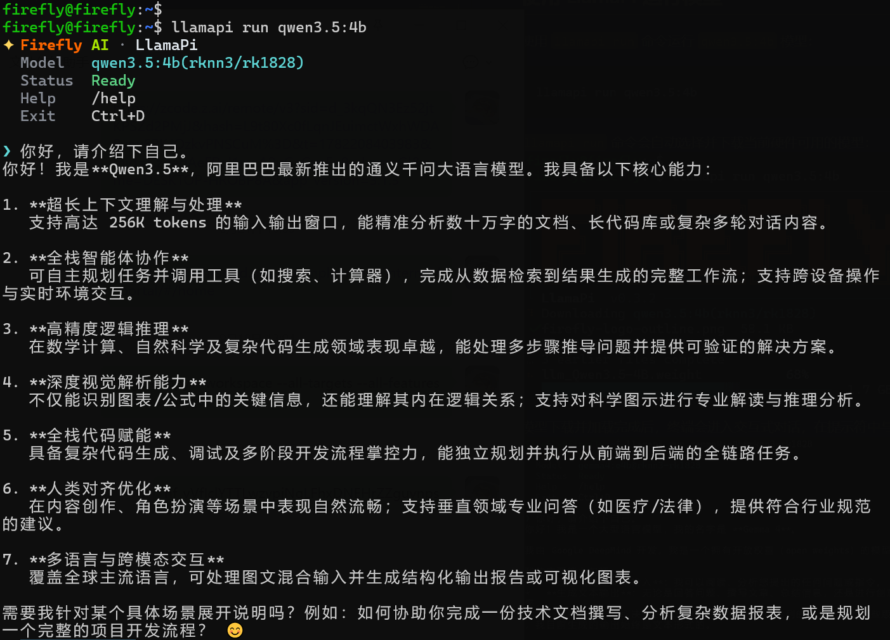
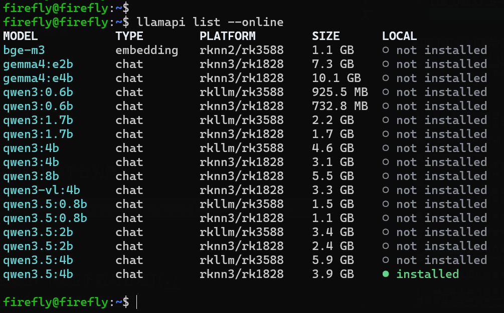

# 快速开始

阅读本节，安装 LlamaPi 并运行第一个模型。

## 安装 LlamaPi

设备已配置 Firefly APT 软件源时，可直接安装 LlamaPi：

```bash
sudo apt install llamapi
```

也可以从 [Firefly 官网下载页](https://community.t-firefly.com/doc/download/428)获取 deb 安装包，将其复制到设备上，再进入文件所在目录安装：

```bash
sudo dpkg -i ./firefly-llamapi-*.deb
```

## 使用 LlamaPi 运行模型

使用 `llamapi run` 命令运行 `qwen3.5:4b` 模型：
```bash
llamapi run qwen3.5:4b
```
`llamapi run` 命令会自动选择并下载当前硬件可用的模型：

模型下载并加载完成后，终端会进入交互式对话，在提示符中与模型进行对话：

对于具有多模态能力的模型可以使用`@`在对话中引入附件：


使用 `/exit` 或 `Ctrl+D` 退出对话。

## 查看当前硬件可用的模型

列出当前硬件可用的模型：

```bash
llamapi list --online
```

以 RK3588 + RK1828 硬件平台为例：



## 下一步

- 下载和删除本地模型：[模型下载与管理](./model-download-and-management.md)
- 运行和部署模型：[模型运行与部署](./model-load-and-run.md)
- 配置模型开机自动加载：[持久化部署](./model-persistence.md)
- 将模型接入现有应用：[接入第三方应用](./third-party-integration.md)
- 在电脑上通过图形界面使用LlamaPi：[客户端的使用](./client-usage.md)
